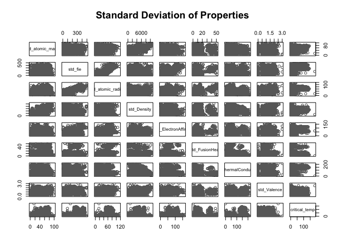
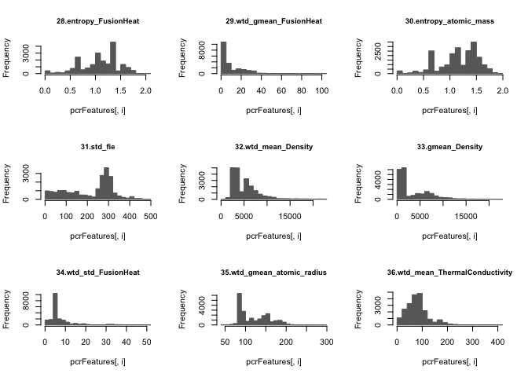
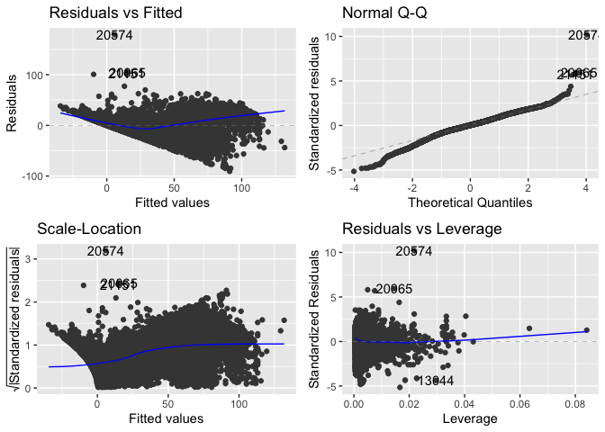
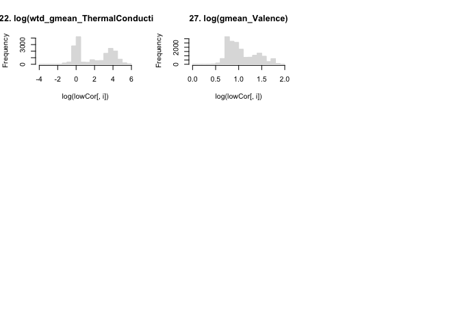

Predicting-Superconducting-Critical-Temperature
================
Iris Wang
8/21/2019

``` r
version
```

    ##                _                           
    ## platform       x86_64-apple-darwin15.6.0   
    ## arch           x86_64                      
    ## os             darwin15.6.0                
    ## system         x86_64, darwin15.6.0        
    ## status                                     
    ## major          3                           
    ## minor          6.1                         
    ## year           2019                        
    ## month          07                          
    ## day            05                          
    ## svn rev        76782                       
    ## language       R                           
    ## version.string R version 3.6.1 (2019-07-05)
    ## nickname       Action of the Toes

# 1\. Introduction

## 1.1 Background

Superconductors are materials that offer no resistance to electrical
current. Prominent examples of superconductors include aluminium,
niobium, magnesium diboride, cuprates such as yttrium barium copper
oxide and iron pnictides. These materials only become superconducting at
temperatures below a certain value, known as the critical temperature
\[nature.com\].

The purpose of this project is to predict the superconducting critical
temperature of a superconductor based on a set of selected features of
chemical properties with different types of machine learning models
developed in R.

## 1.2 Data preparation

#### 1.2.1 Libraries

The libraries that will be used in this assignment

``` r
library(caTools)
library(caret)
library(dplyr)
library(glmnet)
library(ggfortify)
library(ggplot2)
library(ggthemes)
library(gridExtra)
```

#### 1.2.2 Reading in the dataset

We are using the superconduct dataset from the Superconducting Material
Database maintained by Japan’s National Institute for Materials
Science(NIMS).

It contains 21,263 material records, each of which have 82 columns: 81
columns corresponding to the features extracted and the last 1 column of
the observed Tc values. Among those 81 columns, the first column is the
number of elements in the material, the rest 80 columns are features
extracted from 8 properties (each property has 10 features).

``` r
# Load the data
superconductor <- read.csv("train.csv")
# Display the dimensions
cat("The superconductor dataset has", dim(superconductor)[1], "records, each with", dim(superconductor)[2],
    "attributes.")
```

    ## The superconductor dataset has 21263 records, each with 82 attributes.

To get an idea on how our data looks like, we called head() and tail()
functions to print out the first and last few rows of the dataset.

``` r
# first and last few rows of the dataset
print(head(superconductor))
print(tail(superconductor))
```

To get an idea on how our target values Tc distributed in our dataset,
we used summary() and hist(). We saw that the distribution is skewed
right with an median of 20. All values are \> 0, with a maximum at 185.

``` r
summary(superconductor$critical_temp)
```

    ##      Min.   1st Qu.    Median      Mean   3rd Qu.      Max. 
    ##   0.00021   5.36500  20.00000  34.42122  63.00000 185.00000

``` r
hist(superconductor$critical_temp, breaks = 80, main = "Tc", border="grey", col="dimgrey")
```

<!-- -->

# 1.2.3 Methodology and Data Split

Now, we are going to split our data into training set/validation
set/test set for model selection, fitting, and assessment, using the
typical 80:10:10 ratio. Our methodology is to fit the model paremeter
for any given complexity on our training set. For every fitted model, we
are going to assess the performance on the validation set. We then,
based on the performace, select the optimal set of tuning parameters.
Finally, for that specific resulting model, we assess a notion of the
generalization error using our test set.

``` r
# first we generate training set and test set
split = sample.split(superconductor$critical_temp, SplitRatio = 0.8)
training_set = subset(superconductor, split == TRUE)
test_set = subset(superconductor, split == FALSE)

# splits test set into validation set and test set
split = sample.split(test_set$critical_temp, SplitRatio = 0.5)
validation_set = subset(test_set, split == FALSE)
test_set = subset(test_set, split == FALSE)

# reveiew splitting result
split <- c("supercondictor","training_set","validation_set","test_set")
ratio <- c("100%", "80%","10%","10%")
num_records <- c(dim(superconductor)[1],dim(training_set)[1],dim(validation_set)[1],dim(test_set)[1])
num_attributes <- c(dim(superconductor)[2],dim(training_set)[2],dim(validation_set)[2],dim(test_set)[2])
data_dim <- data.frame(split, ratio,num_records, num_attributes)
data_dim
```

    ##            split ratio num_records num_attributes
    ## 1 supercondictor  100%       21263             82
    ## 2   training_set   80%       17290             82
    ## 3 validation_set   10%        1544             82
    ## 4       test_set   10%        1544             82

### 1.2.4 RMSE Function

The defined RMSE function below will be used for calculating RMSE for
the following analysis

``` r
RMSE <- function(predicted, target) {
    se <- 0
    for (i in 1:length(predicted)) {
        se <- se + (predicted[i]-target[i])^2
    }
    return (sqrt(se/length(predicted)))
}
```

# 2\. Exploratary Data Analysis

### 2.1. Collinearity between features

To have a general idea of our data, we first group then and generate
subsuets and look at them one by one.

From the 8 plots on the correlations of the features below, we can see
there are some simillars pattern across all properties. Particularly,
below groups seem to always have strong positive correlations: -
mean/wtd\_mean/gmean - range/std/wtd\_std - entropy/wtd\_entropy

The relationship makes sense, as these value are derived from one
another, so they all depend on each other at some point.

**Subsets 1-4: 10 properties of
atomatic\_mass/fie/atomatic\_radius/Density**

``` r
# Feature 1: atomic_mass
pairs(superconductor[2:11],main = "Relationship between Properties of Atomic Mass",col="dimgrey")
```

<!-- -->

``` r
# Feature 2: fie
pairs(superconductor[12:21],main="Relationship between Properties of Fie",col="dimgrey")
```

<!-- -->

``` r
# Feature 3: atomic_radius
pairs(superconductor[22:31],main="Relationship between Properties of Atomic Radius",col="dimgrey")
```

<!-- -->

``` r
# Feature 4: Density
pairs(superconductor[32:41], main="Relationship between Properties of Density",col="dimgrey")
```

<!-- -->

**Subsets 5-8: 10 properties of
ElectronAffinity/FusionHeat/ThermalConductivity/Valence**

``` r
# Feature 5: ElectronAffinity
pairs(superconductor[42:51],main = "Relationship between Properties of ElectronAffinity",col="dimgrey")
```

<!-- -->

``` r
# Feature 6: FusionHeat
pairs(superconductor[52:61],main="Relationship between Properties of FusionHeat",col="dimgrey")
```

<!-- -->

``` r
# Feature 7: ThermalConductivity
pairs(superconductor[62:71],main="Relationship between Properties of ThermalConductivity",col="dimgrey")
```

<!-- -->

``` r
# Feature 8: Valence
pairs(superconductor[72:81], main="Relationship between Properties of Valence",col="dimgrey")
```

<!-- -->

### 2.2 Correlations between properties

**Subset 1: mean of the 8 properties** Mean values are also a good place
to start, we will first plot out the correlation between pairs of all 9
variables, including number\_of\_elements and mean values of all 8
properties, to see if there is anything interesting between each pairs
of attributes.

``` r
subset_mean <- superconductor[,c(2,12,22,32,42,52,62,72,82)]
dim(subset_mean)
```

    ## [1] 21263     9

``` r
str(subset_mean)
```

    ## 'data.frame':    21263 obs. of  9 variables:
    ##  $ mean_atomic_mass        : num  88.9 92.7 88.9 88.9 88.9 ...
    ##  $ mean_fie                : num  775 766 775 775 775 ...
    ##  $ mean_atomic_radius      : num  160 161 160 160 160 ...
    ##  $ mean_Density            : num  4654 5821 4654 4654 4654 ...
    ##  $ mean_ElectronAffinity   : num  81.8 90.9 81.8 81.8 81.8 ...
    ##  $ mean_FusionHeat         : num  6.91 7.78 6.91 6.91 6.91 ...
    ##  $ mean_ThermalConductivity: num  108 172 108 108 108 ...
    ##  $ mean_Valence            : num  2.25 2 2.25 2.25 2.25 2.25 2.25 2.25 2.25 2.25 ...
    ##  $ critical_temp           : num  29 26 19 22 23 23 11 33 36 31 ...

From the plot we can see there’s stronger relationship between the
following pairs: - mean\_fie and mean\_atomic\_radius -
mean\_atomic\_mass and mean\_Density - mean\_atomic\_radius and
mean\_Density

``` r
pairs(subset_mean[1:9], main="Mean of Properties",col = "dimgrey")
```

<!-- -->

This subset of features tend to have similar kind of distribution of the
target varialble critical\_temp.
<!-- -->

**Subset 2: entropy of the 8 properties**

``` r
subset_entropy <- superconductor[,c(6,16,26,36,46,56,66,76,82)]
dim(subset_entropy)
```

    ## [1] 21263     9

``` r
str(subset_entropy)
```

    ## 'data.frame':    21263 obs. of  9 variables:
    ##  $ entropy_atomic_mass        : num  1.18 1.45 1.18 1.18 1.18 ...
    ##  $ entropy_fie                : num  1.31 1.54 1.31 1.31 1.31 ...
    ##  $ entropy_atomic_radius      : num  1.26 1.51 1.26 1.26 1.26 ...
    ##  $ entropy_Density            : num  1.03 1.31 1.03 1.03 1.03 ...
    ##  $ entropy_ElectronAffinity   : num  1.16 1.43 1.16 1.16 1.16 ...
    ##  $ entropy_FusionHeat         : num  1.09 1.37 1.09 1.09 1.09 ...
    ##  $ entropy_ThermalConductivity: num  0.308 0.847 0.308 0.308 0.308 ...
    ##  $ entropy_Valence            : num  1.37 1.56 1.37 1.37 1.37 ...
    ##  $ critical_temp              : num  29 26 19 22 23 23 11 33 36 31 ...

``` r
pairs(subset_entropy[1:9],main="Entropy of Properties",col="dimgrey")
```

<!-- -->

We noticed this subset of features tend to have jagged and skewed
distrubtion, except entropy\_ThermalConductivity which is more gaussian
distributed
<!-- -->

**Subset 3: std of the 8 properties**

``` r
subset_std <- superconductor[,c(10,20,30,40,50,60,70,80,82)]
dim(subset_std)
```

    ## [1] 21263     9

``` r
str(subset_std)
```

    ## 'data.frame':    21263 obs. of  9 variables:
    ##  $ std_atomic_mass        : num  52 47.1 52 52 52 ...
    ##  $ std_fie                : num  324 290 324 324 324 ...
    ##  $ std_atomic_radius      : num  75.2 67.3 75.2 75.2 75.2 ...
    ##  $ std_Density            : num  3306 3767 3306 3306 3306 ...
    ##  $ std_ElectronAffinity   : num  51.4 49.4 51.4 51.4 51.4 ...
    ##  $ std_FusionHeat         : num  4.6 4.47 4.6 4.6 4.6 ...
    ##  $ std_ThermalConductivity: num  169 199 169 169 169 ...
    ##  $ std_Valence            : num  0.433 0.632 0.433 0.433 0.433 ...
    ##  $ critical_temp          : num  29 26 19 22 23 23 11 33 36 31 ...

``` r
pairs(subset_std[1:9],main="Standard Deviation of Properties",col="dimgrey")
```

<!-- -->

Interestingly, this subset of features tend to have multimodal
distribution.
<!-- -->

### 2.3 Principle Component Analysis

In statistics, PCA is an unsupervised method that linearly projects data
from a high dimensional space into a lower dimensional space. By
maximising the variance of each of the new, uncorrelated dimensions
(principal components), we are able to extract most of the underlying
structure and relationships inherent to the original raw data.

Now, because we have observed strong multicollinearity in our data, we
are now going to try to use PCA as a tool to better understand and
visualise the variance in our dataset in lower dimensions.

``` r
# Principal Component 
pca_model <- prcomp(training_set[,c(1:81)], center = TRUE,scale. = TRUE)
summary(pca_model)
```

    ## Importance of components:
    ##                           PC1    PC2     PC3     PC4     PC5    PC6    PC7
    ## Standard deviation     5.6119 2.9145 2.78403 2.53368 2.18181 1.7543 1.7054
    ## Proportion of Variance 0.3888 0.1049 0.09569 0.07925 0.05877 0.0380 0.0359
    ## Cumulative Proportion  0.3888 0.4937 0.58936 0.66861 0.72738 0.7654 0.8013
    ##                            PC8     PC9    PC10    PC11    PC12    PC13    PC14
    ## Standard deviation     1.59351 1.38079 1.26472 1.21571 1.08688 0.97728 0.90034
    ## Proportion of Variance 0.03135 0.02354 0.01975 0.01825 0.01458 0.01179 0.01001
    ## Cumulative Proportion  0.83263 0.85617 0.87592 0.89416 0.90875 0.92054 0.93055
    ##                           PC15    PC16    PC17    PC18    PC19   PC20    PC21
    ## Standard deviation     0.88596 0.79755 0.76027 0.66079 0.62665 0.5550 0.49567
    ## Proportion of Variance 0.00969 0.00785 0.00714 0.00539 0.00485 0.0038 0.00303
    ## Cumulative Proportion  0.94024 0.94809 0.95523 0.96062 0.96546 0.9693 0.97230
    ##                           PC22    PC23    PC24    PC25    PC26    PC27    PC28
    ## Standard deviation     0.48409 0.45580 0.40904 0.40013 0.38970 0.37209 0.34065
    ## Proportion of Variance 0.00289 0.00256 0.00207 0.00198 0.00187 0.00171 0.00143
    ## Cumulative Proportion  0.97519 0.97776 0.97982 0.98180 0.98368 0.98538 0.98682
    ##                          PC29    PC30    PC31    PC32    PC33    PC34    PC35
    ## Standard deviation     0.3242 0.30353 0.28692 0.27872 0.27506 0.24284 0.23664
    ## Proportion of Variance 0.0013 0.00114 0.00102 0.00096 0.00093 0.00073 0.00069
    ## Cumulative Proportion  0.9881 0.98925 0.99027 0.99123 0.99216 0.99289 0.99358
    ##                           PC36    PC37    PC38    PC39    PC40    PC41    PC42
    ## Standard deviation     0.22336 0.21599 0.19874 0.18833 0.18509 0.16273 0.15833
    ## Proportion of Variance 0.00062 0.00058 0.00049 0.00044 0.00042 0.00033 0.00031
    ## Cumulative Proportion  0.99420 0.99477 0.99526 0.99570 0.99612 0.99645 0.99676
    ##                           PC43    PC44    PC45    PC46   PC47    PC48    PC49
    ## Standard deviation     0.14439 0.13896 0.13430 0.13157 0.1262 0.12332 0.12141
    ## Proportion of Variance 0.00026 0.00024 0.00022 0.00021 0.0002 0.00019 0.00018
    ## Cumulative Proportion  0.99702 0.99725 0.99748 0.99769 0.9979 0.99807 0.99826
    ##                           PC50    PC51    PC52    PC53    PC54    PC55    PC56
    ## Standard deviation     0.11912 0.11283 0.11133 0.10128 0.09873 0.09749 0.09249
    ## Proportion of Variance 0.00018 0.00016 0.00015 0.00013 0.00012 0.00012 0.00011
    ## Cumulative Proportion  0.99843 0.99859 0.99874 0.99887 0.99899 0.99911 0.99921
    ##                           PC57    PC58    PC59    PC60    PC61    PC62    PC63
    ## Standard deviation     0.08468 0.08068 0.08019 0.07655 0.07226 0.06767 0.06007
    ## Proportion of Variance 0.00009 0.00008 0.00008 0.00007 0.00006 0.00006 0.00004
    ## Cumulative Proportion  0.99930 0.99938 0.99946 0.99953 0.99960 0.99965 0.99970
    ##                           PC64    PC65    PC66    PC67    PC68    PC69    PC70
    ## Standard deviation     0.05975 0.05647 0.05314 0.05131 0.04739 0.04277 0.04086
    ## Proportion of Variance 0.00004 0.00004 0.00003 0.00003 0.00003 0.00002 0.00002
    ## Cumulative Proportion  0.99974 0.99978 0.99982 0.99985 0.99988 0.99990 0.99992
    ##                           PC71    PC72    PC73    PC74    PC75    PC76    PC77
    ## Standard deviation     0.03809 0.03667 0.03449 0.02725 0.02481 0.02099 0.01806
    ## Proportion of Variance 0.00002 0.00002 0.00001 0.00001 0.00001 0.00001 0.00000
    ## Cumulative Proportion  0.99994 0.99995 0.99997 0.99998 0.99999 0.99999 0.99999
    ##                           PC78    PC79     PC80     PC81
    ## Standard deviation     0.01366 0.01101 0.008574 0.007021
    ## Proportion of Variance 0.00000 0.00000 0.000000 0.000000
    ## Cumulative Proportion  1.00000 1.00000 1.000000 1.000000

The result tells us that we are actually able to capture up to almost
99% of variance in the entire dataset using only 30 principal
components.

Now we will quickly run a Principal Component Regression using some of
the key principal components we just calculated and see how it goes.

``` r
pcr_model <- train(critical_temp ~ .,
                         data = training_set,
                         method = 'pcr',
                         tuneGrid = expand.grid(ncomp = seq(2,40,2)),
                         trControl = ,
                         preProc = c('center','scale','BoxCox'))


pcr_model$results
```

    ##    ncomp     RMSE  Rsquared      MAE    RMSESD  RsquaredSD     MAESD
    ## 1      2 25.80509 0.4328736 21.09234 0.2055013 0.005996179 0.1714187
    ## 2      4 23.55909 0.5272883 18.75059 0.1914502 0.004763154 0.1496328
    ## 3      6 22.22243 0.5793680 17.71777 0.1882581 0.005172701 0.1943126
    ## 4      8 22.18008 0.5809656 17.56636 0.1779514 0.005002654 0.1285003
    ## 5     10 22.17610 0.5811195 17.55078 0.1804971 0.005139872 0.1323428
    ## 6     12 21.85292 0.5932461 17.25519 0.1862846 0.005242203 0.1245680
    ## 7     14 21.76859 0.5963820 17.16720 0.1894203 0.005306097 0.1292960
    ## 8     16 21.55827 0.6041415 17.03528 0.2066638 0.005727378 0.1344176
    ## 9     18 21.45384 0.6079659 16.92314 0.2041252 0.005574600 0.1413730
    ## 10    20 21.25138 0.6153134 16.82250 0.2080405 0.005639768 0.1426224
    ## 11    22 20.90565 0.6277357 16.73052 0.2043475 0.005302517 0.1447818
    ## 12    24 20.51574 0.6415193 16.31519 0.1798149 0.005152612 0.1321493
    ## 13    26 19.82116 0.6654092 15.65610 0.1890576 0.005136843 0.1322013
    ## 14    28 19.82296 0.6653519 15.64936 0.1913741 0.005126523 0.1274938
    ## 15    30 19.52985 0.6751772 15.24706 0.2482481 0.006570240 0.1883604
    ## 16    32 19.39460 0.6796684 15.09926 0.2147704 0.005888360 0.1436116
    ## 17    34 19.36513 0.6806389 15.08152 0.2140616 0.005759970 0.1445393
    ## 18    36 19.33911 0.6815030 15.04811 0.2013528 0.005373372 0.1467192
    ## 19    38 18.93655 0.6946191 14.55768 0.1792757 0.005217334 0.1388234
    ## 20    40 18.93796 0.6945777 14.55343 0.1853209 0.005233634 0.1395223

``` r
pcr_model$bestTune
```

    ##    ncomp
    ## 19    38

Not too well with just an rsqured of 0.7 wiht 40 principal componets.
The underfitted model might be the result of a small number of principal
components \(d\), or the potential non-linear relationship between the
predictors and response variable. Which we will be discussing more in
the model selection section.

But what are the significant features identified by this algorithm?

``` r
pcr_features = varImp(pcr_model)

pcr_top40 = data.frame(feature = pcr_features$importance%>% rownames(),
           overall = pcr_features$importance$Overall)

pcr_top40 = pcr_top40[order(pcr_top40$overall,decreasing = TRUE),][1:40,]

# Generates a slice for top 40 important features
pcrFeatures = pcr_top40$feature %>% as.character()

# generates a subset from superconductor
pcrFeatures <- superconductor %>% select(append(pcrFeatures,"critical_temp"))
```

We plot the histograms of all these features. We noticed that there are
4 features having similar distributions with critical\_temp, including:

  - wtd\_gmean\_Density
  - wtd\_mean\_FusionHeat
  - wtd\_gmean\_FusionHeat
  - wtd\_range\_FusionHeat

<!-- end list -->

``` r
# log transformation on features with skewed dist
N = ncol(pcrFeatures)
colorcode <- rep("dimgrey",N)
colorcode[N] <- "deeppink"
par(mfrow=c(3, 3))
for (i in 1:(N)) {
  hist(pcrFeatures[,i], breaks = 20, main = paste(i,names(pcrFeatures)[i],sep="."), border=colorcode[i],
       col=colorcode[i],cex.main=0.9)
}
```

<!-- --><!-- --><!-- --><!-- --><!-- -->

Based on the above, we further explore some interesting relationships
between the significant features through data visualisation.

``` r
ggplot(superconductor, 
       aes(x =wtd_gmean_Density , y =critical_temp, color = wtd_std_ThermalConductivity)) +
  geom_point(aes(size =number_of_elements), alpha = 0.4) +
  ggtitle("Data Exploration - Figure 1") +
  theme(plot.title = element_text(hjust = 0.5)) +
  scale_color_distiller(palette = "Paired") +theme_light()
```

<!-- -->

``` r
ggplot(superconductor, 
       aes(x = number_of_elements , y = wtd_gmean_Valence, color = wtd_mean_Valence)) +
  geom_point(aes(size = wtd_std_ThermalConductivity), alpha = 0.4) +
  ggtitle("Data Exploration - Figure 2") +
  theme(plot.title = element_text(hjust = 0.5)) +
  scale_color_distiller(palette = "Paired") +theme_light()
```

<!-- -->

``` r
ggplot(superconductor, 
       aes(x = number_of_elements , y =wtd_gmean_Density , color = entropy_atomic_mass)) +
  geom_point(aes(size = wtd_std_ThermalConductivity), alpha = 0.4) +
  ggtitle("Data Exploration - Figure 3") +
  theme(plot.title = element_text(hjust = 0.5)) +
  scale_color_distiller(palette = "Paired") +theme_light()
```

<!-- -->

``` r
ggplot(superconductor, 
       aes(x = number_of_elements , y =entropy_atomic_mass, color =critical_temp )) +
  geom_point(aes(size = mean_atomic_mass), alpha = 0.4) +
  ggtitle("Data Exploration - Figure 4") +
  theme(plot.title = element_text(hjust = 0.5)) +
  scale_color_distiller(palette = "Paired") +theme_light()
```

<!-- -->

``` r
ggplot(superconductor, 
       aes(x = wtd_entropy_Valence , y =wtd_entropy_atomic_radius , color = wtd_entropy_FusionHeat)) +
  geom_point(aes(size = range_atomic_radius), alpha = 0.4) +
  ggtitle("Data Exploration - Figure 5") +
  theme(plot.title = element_text(hjust = 0.5)) +
  scale_color_distiller(palette = "Paired") +theme_light()
```

<!-- -->

``` r
ggplot(superconductor, 
       aes(x = wtd_gmean_Density, y =wtd_gmean_fie , color = wtd_std_fie)) +
  geom_point(aes(size = range_fie), alpha = 0.4) +
  ggtitle("Data Exploration - Figure 6") +
  theme(plot.title = element_text(hjust = 0.5)) +
  scale_color_distiller(palette = "Paired") +theme_light()
```

<!-- -->

``` r
ggplot(superconductor, 
       aes(x = wtd_gmean_Density, y =log(critical_temp), color =wtd_std_atomic_radius)) +
  geom_point(aes(size = std_atomic_radius), alpha = 0.4) +
  ggtitle("Data Exploration - Figure 7") +
  theme(plot.title = element_text(hjust = 0.5)) +
  scale_color_distiller(palette = "Paired")  +theme_light()
```

<!-- -->

``` r
ggplot(superconductor, 
       aes(x = range_fie, y =std_atomic_radius, color =wtd_std_atomic_radius)) +
  geom_point(aes(size = wtd_mean_FusionHeat), alpha = 0.4) +
  ggtitle("Data Exploration - Figure 8") +
  theme(plot.title = element_text(hjust = 0.5)) +
  scale_color_distiller(palette = "Paired") +theme_light()
```

<!-- -->

# 3\. Model developmemnt

# 3.1 Linear regression

### 3.1.1 Linear regression with all variables

Our first model is going to be the most classic Linear Regression. We
love it for its simplicity, interpretability\! We’ll first fit the model
by calling `lm()`, and then we call `summary()` to summarize the
results.

``` r
# Fitting Simple Linear Regression to the Training set
fit1.1 = lm(formula = critical_temp ~ .,
               data = training_set)
```

There are a few points we wanted to highlight here: - The R-squred 0.74
indicates that the model explains 74% of the variation in Tc - The
F-statistic 608 has a p-value \< 2.2e-16, so reject the null hypothesis
(the model explains nothing) and accept the althernative hypothesis that
the model is useful

``` r
# prints important stats
num_features1.1 <- dim(summary(fit1.1)$coefficients)[1]-1
cat("Number of features in model 1.1 = ",num_features1.1)
```

    ## Number of features in model 1.1 =  81

``` r
cat("\nRsquared = ",summary(fit1.1)$adj.r.squared)
```

    ## 
    ## Rsquared =  0.7365403

``` r
cat("\nF-statistic =", summary(fit1.1)$fstatistic[1])
```

    ## 
    ## F-statistic = 597.7152

### 3.1.1 Linear regression with stepwise feature selection

Initially, we had all 81 in our model. But we doubted if they are all
that important and necessary. To really find out the optmized subset of
features, the all subset algorithms is an option. However, in this case,
given the size of our dataset and the number of attibutes in hand, due
to the fact that the computational complexity of such brute force
algorithm is exponential.

Our other option is to do a sub-optimal approach such as stepwise
algorithm for feature selection. How stepwise search (or Greedy search)
works is you start with some set of possible features (or zero feature),
and then you greedily walk through features, and select the best one to
take or drop, and then you keep iterating. Here, we ran the step()
function, a stpewise algorithm for feature selection by AIC, to find it
out.

Even though this procedure is significantly more computational efficient

O(\(D^{2}\)) \>\> O(\(2^{D}\)) for large D

given the search data size and search time, we only did backwards and
both direcation searches this time.

``` r
# Run step to remove unnecessary variables
sback_fit1.1 = step(fit1.1,direction = "backward")
sboth_fit1.1 = step(fit1.1,direction = "both")
# extract AIC
aic_fit1.1 <- extractAIC(fit1.1)
aic_sback_fit1.1 <- extractAIC(sback_fit1.1)
aic_sboth_fit1.1 <- extractAIC(sboth_fit1.1)
```

According to the step() results, the backward/both selection gave us the
same results, removing 11 features from our model and achieved lower
AIC.

``` r
stepResults.fit1 = data.frame(
  "num_predictors" = 
    c("beginning.fit"=aic_fit1.1[1]-1,
                      "step.backward"=aic_sback_fit1.1[1]-1,"step.both"=aic_sboth_fit1.1[1]-1),
  "aic" = 
    c("beginning.fit"=aic_fit1.1[2],
             "step.backward"=aic_sback_fit1.1[2],"step.both"=aic_sboth_fit1.1[2])
)
stepResults.fit1
```

    ##               num_predictors      aic
    ## beginning.fit             81 99339.58
    ## step.backward             67 99323.95
    ## step.both                 68 99323.91

Now let’s prepare to remove these features and update the model

``` r
# feature removed by step()
removed <- sback_fit1.1$anova$Step
# string argument for updating the linear model
formula = paste(".~.",paste(removed,collapse = ""),sep = "")
formula
```

    ## [1] ".~.- wtd_std_ThermalConductivity- wtd_range_Density- wtd_entropy_ThermalConductivity- wtd_mean_Density- gmean_atomic_radius- wtd_range_Valence- std_FusionHeat- wtd_range_atomic_mass- wtd_entropy_atomic_mass- wtd_std_atomic_mass- wtd_mean_fie- gmean_fie- mean_fie- entropy_ElectronAffinity"

We updated our model 1.1 and removed the 7 features by using the string
input we defined above. The updated model gave us a similar rsqured
while using less predictors.

``` r
# update fit1
fit1.2 <- update(fit1.1,formula)

# prints out stats
num_features1.2 <- dim(summary(fit1.2)$coefficients)[1]-1
cat("Number of features in model 1.2 = ",num_features1.2)
```

    ## Number of features in model 1.2 =  67

``` r
cat("\nRsquared = ",summary(fit1.2)$adj.r.squared)
```

    ## 
    ## Rsquared =  0.7365659

### 3.1.2 Linear regression with significant variables

In addition to the step() function above, we wanted to explore some
other options in feature selection. Here, we used varImp() function to
calculate importance of all 81 predictors initially in our first model.

``` r
# train the model
fit1.3 <- train(critical_temp ~., data = training_set, method = 'lm',preProcess="scale",trControl = trainControl(method = "cv"))

# List of features with their importance scores
importance1.3 <- varImp(fit1.3, scale=FALSE)
print(importance1.3)
```

    ## lm variable importance
    ## 
    ##   only 20 most important variables shown (out of 81)
    ## 
    ##                               Overall
    ## std_ElectronAffinity           19.064
    ## range_ElectronAffinity         18.927
    ## wtd_mean_ThermalConductivity   17.206
    ## wtd_range_ThermalConductivity  13.680
    ## wtd_std_ElectronAffinity       12.810
    ## wtd_mean_atomic_radius         11.971
    ## wtd_gmean_ElectronAffinity     11.947
    ## wtd_entropy_FusionHeat         11.619
    ## range_atomic_mass              11.545
    ## wtd_std_Valence                11.539
    ## wtd_entropy_Valence            11.244
    ## wtd_gmean_atomic_radius        10.706
    ## wtd_gmean_ThermalConductivity  10.577
    ## range_fie                       9.818
    ## wtd_mean_ElectronAffinity       9.449
    ## mean_atomic_mass                9.431
    ## mean_Density                    8.857
    ## wtd_mean_FusionHeat             8.629
    ## wtd_entropy_fie                 8.473
    ## wtd_entropy_ElectronAffinity    8.370

Let’s organize the data nad rank the features by importance score and
extract the top 60 for modeling

``` r
# extracts reletive elements from the original output list
rank = importance1.3$importance$Overall

# generates a new list called features including columns of feature names and their rankings
features <- training_set %>% select(-critical_temp) %>% names()
important1.3 = data.frame(features, rank)
important1.3 = important1.3[order(important1.3$rank,decreasing=TRUE),]

# Generates a slice for top 60 important features
top60 = important1.3[1:60,1] %>% as.character()
top60
```

    ##  [1] "std_ElectronAffinity"          "range_ElectronAffinity"       
    ##  [3] "wtd_mean_ThermalConductivity"  "wtd_range_ThermalConductivity"
    ##  [5] "wtd_std_ElectronAffinity"      "wtd_mean_atomic_radius"       
    ##  [7] "wtd_gmean_ElectronAffinity"    "wtd_entropy_FusionHeat"       
    ##  [9] "range_atomic_mass"             "wtd_std_Valence"              
    ## [11] "wtd_entropy_Valence"           "wtd_gmean_atomic_radius"      
    ## [13] "wtd_gmean_ThermalConductivity" "range_fie"                    
    ## [15] "wtd_mean_ElectronAffinity"     "mean_atomic_mass"             
    ## [17] "mean_Density"                  "wtd_mean_FusionHeat"          
    ## [19] "wtd_entropy_fie"               "wtd_entropy_ElectronAffinity" 
    ## [21] "std_atomic_mass"               "range_atomic_radius"          
    ## [23] "std_fie"                       "std_Density"                  
    ## [25] "wtd_mean_atomic_mass"          "wtd_gmean_FusionHeat"         
    ## [27] "wtd_range_FusionHeat"          "wtd_entropy_atomic_radius"    
    ## [29] "mean_FusionHeat"               "gmean_FusionHeat"             
    ## [31] "entropy_atomic_mass"           "wtd_entropy_Density"          
    ## [33] "range_Valence"                 "range_Density"                
    ## [35] "entropy_FusionHeat"            "wtd_range_ElectronAffinity"   
    ## [37] "std_ThermalConductivity"       "wtd_gmean_atomic_mass"        
    ## [39] "range_FusionHeat"              "gmean_atomic_mass"            
    ## [41] "entropy_ThermalConductivity"   "wtd_range_fie"                
    ## [43] "range_ThermalConductivity"     "wtd_range_atomic_radius"      
    ## [45] "entropy_fie"                   "entropy_Valence"              
    ## [47] "number_of_elements"            "entropy_Density"              
    ## [49] "gmean_ElectronAffinity"        "entropy_atomic_radius"        
    ## [51] "wtd_std_FusionHeat"            "wtd_std_atomic_radius"        
    ## [53] "std_atomic_radius"             "wtd_gmean_Density"            
    ## [55] "wtd_gmean_Valence"             "gmean_Valence"                
    ## [57] "wtd_std_Density"               "mean_ThermalConductivity"     
    ## [59] "gmean_Density"                 "wtd_mean_Valence"

#### Re-fits top 60 features

This time, with using only 60 selected features, we achieve almost the
same r-square 0.74 we obtained using up to 74 features previously. In
this case, we would say thay the varImp() did better job than step() in
feature selection, because it provides more effiecient solution for our
model.

``` r
# generates a subset of traninig data for top 60 features
features_top60 <- append(top60,"critical_temp")
training1.3 <- training_set %>% select(features_top60)
```

    ## Note: Using an external vector in selections is ambiguous.
    ## ℹ Use `all_of(features_top60)` instead of `features_top60` to silence this message.
    ## ℹ See <https://tidyselect.r-lib.org/reference/faq-external-vector.html>.
    ## This message is displayed once per session.

``` r
# refits model using top60 features
fit1.3 = lm(formula = critical_temp~ .,
               data = training1.3)

num_features1.3 <- dim(summary(fit1.3)$coefficients)[1]-1
cat("Number of features in model 1.3 = ",num_features1.3)
```

    ## Number of features in model 1.3 =  60

``` r
cat("\nRsquared = ",summary(fit1.3)$adj.r.squared)
```

    ## 
    ## Rsquared =  0.7330209

#### Assessment on validation set

Now that we have three fitted models at the moment, we are going to
assess each of them on the validation set and compare their performance.

``` r
# Model 1.1 Predicting Tc for training/validation set 
pred_train1.1 = predict(fit1.1, newdata = training_set)
rmse_train1.1 <- RMSE(pred_train1.1, training_set$critical_temp)
pred_validation1.1 = predict(fit1.1, newdata = validation_set)
rmse_v1.1 <- RMSE(pred_validation1.1, validation_set$critical_temp)
rsq_v1.1 <- cor(pred_validation1.1, validation_set$critical_temp)^2

# Model 1.2 Predicting Tc for training/validation set
pred_train1.2 = predict(fit1.2, newdata = training_set)
rmse_train1.2 <- RMSE(pred_train1.2, training_set$critical_temp)
pred_validation1.2 = predict(fit1.2, newdata = validation_set)
rmse_v1.2 <- RMSE(pred_validation1.2, validation_set$critical_temp)
rsq_v1.2 <- cor(pred_validation1.2, validation_set$critical_temp)^2

# Model 1.3 Predicting Tc for training/validation set
pred_train1.3 = predict(fit1.3, newdata = training_set)
rmse_train1.3 <- RMSE(pred_train1.3, training_set$critical_temp)
pred_validation1.3 = predict(fit1.3, newdata = validation_set)
rmse_v1.3 <- RMSE(pred_validation1.3, validation_set$critical_temp)
rsq_v1.3 <- cor(pred_validation1.3, validation_set$critical_temp)^2
```

#### RMSE analysis

Comparing the three models, we believe that model 1.3 is a better one,
since it was able to acheieve the similar results using less predictors.

``` r
lin_reg_model1.1 <- c("num_predictors"=num_features1.1,
             "adj.rsquared_train"=summary(fit1.1)$adj.r.squared,
             "adj.rsquared_validation"=rsq_v1.1,
             "rmse_validation"=rmse_v1.1)

lin_reg_model1.2 <- c("num_predictors"=num_features1.2,
           "adj.rsquared_train"=summary(fit1.2)$adj.r.squared,
           "adj.rsquared_validation"=rsq_v1.2,
           "rmse_validation"=rmse_v1.2)

lin_reg_model1.3 <- c("num_predictors"=num_features1.3,
           "adj.rsquared_train"=summary(fit1.3)$adj.r.squared,
           "adj.rsquared_validation"= rsq_v1.3,
           "rmse_validation"= rmse_v1.3)

# creates a df by combing above vectors
models.1 <- data.frame(lin_reg_model1.1,lin_reg_model1.2,lin_reg_model1.3)
models.1
```

    ##                         lin_reg_model1.1 lin_reg_model1.2 lin_reg_model1.3
    ## num_predictors                81.0000000       67.0000000       60.0000000
    ## adj.rsquared_train             0.7365403        0.7365659        0.7330209
    ## adj.rsquared_validation        0.7195579        0.7194319        0.7141233
    ## rmse_validation.3             17.6649126       17.6691961       17.8351891

#### Diagnostic plots

We will firt call autoplot() from ggfortify package to calculate and
produce diagnostic plots and see if there are any serious problems
inherented in our model.

  - Residuals vs Fitted : shows the residuals are not evenly distributed
    around zero, this suggests that the assumption that the relationship
    is linear is not reasonable, also the variances of the error terms
    are unequal.
  - Normal Q-Q indicates the plot tells us there’s evidence of
    non-linearity
  - Scale-Location plot tells us the residuals are not spread equally
    along the ranges of predictors
  - Residuals vs Leverage helps us to find influential cases, but there
    seems no such case here

<!-- end list -->

``` r
autoplot(fit1.3)
```

<!-- -->

#### Generalization of error

Since model 1.3 has been selected as our first official model based on
the performance on the validation, we are now going to assess its
performance on the test set. We then assume the test errors as an
approximation of our generalization error.

``` r
# Predicting Tc for training/test
pred_test1.3 = predict(fit1.3, newdata = test_set)
rmse_test1.3 <- RMSE(pred_test1.3,test_set$critical_temp)
# Calculates RMSE of training pred
cat("\nLINEAR REGRESSION MODEL 1.3: RMSE for the test predictions =", rmse_test1.3)
```

    ## 
    ## LINEAR REGRESSION MODEL 1.3: RMSE for the test predictions = 17.83519

#### Visualization of gernerailzed error

As we can see, we got this very similar RMSE that we have seen on the
training/validation set. To get a better idea on the fitness, we
visualized the perfomance using ggplot().

From the plot, we could tell that, althoght not that strong, there’s
still a linear relationship between the true values and the predicted
ones. That should be a fair representation on the fitness of this model.

``` r
# Visualizing the fit
Linear_regression_test <- ggplot() +
  geom_point(aes(x = test_set$critical_temp, y = pred_test1.3),
            colour = 'gold2',alpha=0.5,size=3) +
  ggtitle('Linear Regression') +
  ylab('Prediction') +
  xlab('True Value (Tc)') +
  theme_minimal() + 
  geom_abline(colour = "grey80", size = 1)

Linear_regression_test 
```

<!-- -->

### 3.1.3 Linear Regression with transfored dataset

To further improve our model, we are going to try and generate two-way
interaction terms for fitting our second model. Particularly, we are
going to generate interaction terms using features with low
collinearity, since we know that collinearity, which is the correlation
between predictor variables supply redundant information to the model,
and may consequently effect model performance.

Thus, the first step is to pin down these features using the
findCorrelation() function. By setting the cutoff threshold as 0.8, we
got 29 selected features

#### Collinearity analysis

``` r
# Identifies highly correlated terms
correlationMatrix <- cor(training_set[,1:81])

# findCorrelation() searches through a correlation matrix 
# and returns a vector of integers corresponding to columns to remove to reduce pair-wise correlations.
highlyCorrelated <- findCorrelation(correlationMatrix, cutoff=0.8)
cat("Number of highly correlated features (to be removed) =",length(highlyCorrelated))
```

    ## Number of highly correlated features (to be removed) = 52

``` r
# creates a subset containing only features with correlation < 0.8
lowCor = training_set[,-highlyCorrelated]
cat("\nNumber of features with correlation lower than 0.8 (to be selected) =",length(lowCor)-1)
```

    ## 
    ## Number of features with correlation lower than 0.8 (to be selected) = 29

#### Skewness analysis

As we looked at the histograms of all 29 features selected based on the
collinearity, we found that most of the features have weird
distributions.

``` r
# looks at distribution of each feature
par(mfrow=c(3, 3))
N = ncol(lowCor) -1
for (i in 1:N) {
  hist(lowCor[,i], breaks = 20, main = paste(i,names(lowCor)[i],sep = ". "), border="grey", col="darkgrey")
}
```

<!-- --><!-- --><!-- --><!-- -->

#### Account for the heteroscedasticity

Since there are too many features to look at at a time, we automatically
generated histograms for those features (those do not have any zero
values) with log transformation, and check the distributions again of
each one of them.

We spotted the three of them (highlighted in yellow) have become more
gaussian in their distributions after log transformation. These
following five features below with log transformations will be included
in our model:

  - gmean\_fie
  - mean\_Density
  - gmean\_ElectronAffinity
  - wtd\_gmean\_ElectronAffinity
  - mean\_FusionHeat

<!-- end list -->

``` r
# log transformation on features with skewed dist
par(mfrow=c(3, 3))
N = ncol(lowCor) -1
colorcode <- rep("gray87",29)
colorcode[c(3,9,13,14,18)] <- "goldenrod"
for (i in 1:N) {
  if (min(lowCor[,i])>0){
    hist(log(lowCor[,i]), breaks = 20, main = paste(i,paste("log(",names(lowCor)[i],")",sep = ""),sep = ". "), border=colorcode[i], col=colorcode[i])
  }
}
```

<!-- --><!-- -->

We removed the three features with skewed distributions and added the
log transformed terms back into our string argument for fitting the
model

``` r
# generate a subset of features with low correlation coeficients, while excluding 3 highly skewed terms
features2.1 <- lowCor %>% select(-c(3,9,13,14,18))%>%select(-critical_temp) %>% names()

# adding back the three originally skewed terms after applying log transformation, and generates an string argument for updating the model fit
formula <- paste(paste(features2.1,collapse = "+"),"log(gmean_fie) + log(mean_Density) + log(gmean_ElectronAffinity)+log(wtd_gmean_ElectronAffinity)+log(mean_FusionHeat))^2",sep = "+")
formula <- paste0(".~. +(",formula)
formula
```

    ## [1] ".~. +(mean_atomic_mass+std_atomic_mass+wtd_gmean_fie+wtd_range_fie+mean_atomic_radius+wtd_range_atomic_radius+std_atomic_radius+wtd_entropy_Density+wtd_range_Density+wtd_std_Density+wtd_entropy_ElectronAffinity+wtd_range_ElectronAffinity+std_ElectronAffinity+wtd_range_FusionHeat+std_FusionHeat+mean_ThermalConductivity+wtd_gmean_ThermalConductivity+entropy_ThermalConductivity+wtd_entropy_ThermalConductivity+wtd_range_ThermalConductivity+std_ThermalConductivity+gmean_Valence+range_Valence+wtd_range_Valence+log(gmean_fie) + log(mean_Density) + log(gmean_ElectronAffinity)+log(wtd_gmean_ElectronAffinity)+log(mean_FusionHeat))^2"

#### Fit the feature crosses to the model

The rsquare value turned out to be 0.82, much higher than the previous
0.74. However, we have also seen a big jump in the number of features.
Maybe some of the features are not that important and thus can be
excluded. To reduce the number of features while trying to keep up with
the good performance, we are going to do feature selection later.

``` r
# refits the model by updating model 1
fit2.1 <- update(fit1.3,formula,data=training_set)

# prints stats to console
num_features2.1 <- dim(summary(fit2.1)$coefficients)[1]-1
cat("MODEL 2.1: number of predictors = ",num_features2.1)
```

    ## MODEL 2.1: number of predictors =  477

``` r
cat("\nTraining adj.rsquared = ",summary(fit2.1)$adj.r.squared)
```

    ## 
    ## Training adj.rsquared =  0.8129409

#### Diagnostic plots

  - Residuals vs Fitted plot tells us the residuals have non-linear
    patterns
  - Normal Q-Q indicates the residuals are not normally distributed.
  - Scale-Location plot suggests that the residuals are not spread
    equally along the ranges of predictors, as the residuals do not
    appear randomly spread
  - Residuals vs Leverage gives us a typical look when there is no
    influential case

<!-- end list -->

``` r
autoplot(fit2.1)
```

<!-- -->

Performance of model 2.1 on the validation set was better than our
previous models, as we got a lower RMSE here

``` r
# Predicting Tc for validation set
pred_v2.1 <- predict(fit2.1, newdata = validation_set)

# Calculates RMSE
rmse_v2.1 <- RMSE(pred_v2.1, validation_set$critical_temp)
cat("\nMODEL 2.1: Validation RMSE =", rmse_v2.1)
```

    ## 
    ## MODEL 2.1: Validation RMSE = 15.25851

``` r
# Rsquared
rsq_v2.1 <- cor(pred_v2.1, validation_set$critical_temp)^2
cat("\nValidation adj.rsquared = ",rsq_v2.1)
```

    ## 
    ## Validation adj.rsquared =  0.7907037

### 3.1.4 Linear regression with regularisation

As more features we use, the more complex the model becomes, and more
likely it becomes overfit. And high complexity models could have low
bias, but high variance. In this case, we want to trade off between bias
and variance to get to that sweet spot of having good predictive
performance.

One way to automatically balance between bias and variance is called
regularization. To balance between the two measures, we introduced a new
term \(lambda\) and modified the cost function as below:

#### Total Cost = (Measure of Fit) + \(\lambda\)\*(Magnitude of Coefficients)

In essence, the tuning parameter \(\lambda\) controls model complexity,
and controls such bias/variance trade-off.

In this section, we are going to use two regulariztion techniques: Ridge
Regression and Lasso Regression to fit to our second model.

#### Data preparation

When we ran the lm() function on the interaction terms, we input this
string argument *critical\_temp \~(.)^2*. But it does not work for the
glmnet function, as takes matices as input arguments. So we need to
manually create the set of features.

To generate the interaction terms, the first step is to put together all
the selected features (with low collinearity) as a matrix using
model.matrix(). After the interaction terms are generated , we convert
the matrix back to dataframe, so we can easily combine the top 60
important features used in model 1 and the interaction terms as the
training set for regularization.

``` r
# creates a copy of 60 important features used in model 1 
training2.2 <- training1.3
validation2.2 <- validation_set %>% select(names(training2.2))
test2.2 <- test_set  %>% select(names(training2.2))

# generates subset of features with low correlation while replaces the originally skewed terms with log transformed terms
# generates string argument for later fitting the model.matrix()
features_lowCor <- lowCor %>% select(-c(3,9,13))%>%select(-critical_temp) %>% names()
formula <- paste("critical_temp~(",paste(paste(features_lowCor,collapse = "+"),"log(gmean_fie) + log(mean_Density) + log(gmean_ElectronAffinity))^2",sep = "+"),sep="")
formula
```

    ## [1] "critical_temp~(mean_atomic_mass+std_atomic_mass+wtd_gmean_fie+wtd_range_fie+mean_atomic_radius+wtd_range_atomic_radius+std_atomic_radius+wtd_entropy_Density+wtd_range_Density+wtd_std_Density+wtd_gmean_ElectronAffinity+wtd_entropy_ElectronAffinity+wtd_range_ElectronAffinity+std_ElectronAffinity+mean_FusionHeat+wtd_range_FusionHeat+std_FusionHeat+mean_ThermalConductivity+wtd_gmean_ThermalConductivity+entropy_ThermalConductivity+wtd_entropy_ThermalConductivity+wtd_range_ThermalConductivity+std_ThermalConductivity+gmean_Valence+range_Valence+wtd_range_Valence+log(gmean_fie) + log(mean_Density) + log(gmean_ElectronAffinity))^2"

Prepares training set for regularization…

``` r
# creates a matrix for interaction terms using the string argument we created above
train_interact <- model.matrix(critical_temp~(mean_atomic_mass+std_atomic_mass+wtd_gmean_fie+wtd_range_fie+mean_atomic_radius+wtd_range_atomic_radius+std_atomic_radius+wtd_entropy_Density+wtd_range_Density+wtd_std_Density+wtd_gmean_ElectronAffinity+wtd_entropy_ElectronAffinity+wtd_range_ElectronAffinity+std_ElectronAffinity+mean_FusionHeat+wtd_range_FusionHeat+std_FusionHeat+mean_ThermalConductivity+wtd_gmean_ThermalConductivity+entropy_ThermalConductivity+wtd_entropy_ThermalConductivity+wtd_range_ThermalConductivity+std_ThermalConductivity+gmean_Valence+range_Valence+wtd_range_Valence+log(gmean_fie) + log(mean_Density) + log(gmean_ElectronAffinity))^2,training_set)[,-1]

# removes duplicates by indexing and filtering
train_interact <- train_interact %>% as.data.frame()
train_interact <- train_interact[which(!names(train_interact) %in% names(training2.2))]
training2.2 <- cbind(train_interact,training2.2)
dim(training2.2)
```

    ## [1] 17290   476

Same procedure of preparing validation set for regulariztion…

``` r
# creates a set of features including interaction terms (test set)
v_interact <- model.matrix(critical_temp~(mean_atomic_mass+std_atomic_mass+wtd_gmean_fie+wtd_range_fie+mean_atomic_radius+wtd_range_atomic_radius+std_atomic_radius+wtd_entropy_Density+wtd_range_Density+wtd_std_Density+wtd_gmean_ElectronAffinity+wtd_entropy_ElectronAffinity+wtd_range_ElectronAffinity+std_ElectronAffinity+mean_FusionHeat+wtd_range_FusionHeat+std_FusionHeat+mean_ThermalConductivity+wtd_gmean_ThermalConductivity+entropy_ThermalConductivity+wtd_entropy_ThermalConductivity+wtd_range_ThermalConductivity+std_ThermalConductivity+gmean_Valence+range_Valence+wtd_range_Valence+log(gmean_fie) + log(mean_Density) + log(gmean_ElectronAffinity))^2,validation_set)[,-1]


v_interact <- v_interact %>% as.data.frame()
v_interact <- v_interact[which(!names(v_interact) %in% names(validation2.2))]
validation2.2 <- cbind(v_interact,validation2.2)
dim(validation2.2)
```

    ## [1] 1544  476

Still the same proceduer preparing test set for regulariztion…

``` r
# creates a set of features including interaction terms (test set)
test_interact <- model.matrix(critical_temp~(mean_atomic_mass+std_atomic_mass+wtd_gmean_fie+wtd_range_fie+mean_atomic_radius+wtd_range_atomic_radius+std_atomic_radius+wtd_entropy_Density+wtd_range_Density+wtd_std_Density+wtd_gmean_ElectronAffinity+wtd_entropy_ElectronAffinity+wtd_range_ElectronAffinity+std_ElectronAffinity+mean_FusionHeat+wtd_range_FusionHeat+std_FusionHeat+mean_ThermalConductivity+wtd_gmean_ThermalConductivity+entropy_ThermalConductivity+wtd_entropy_ThermalConductivity+wtd_range_ThermalConductivity+std_ThermalConductivity+gmean_Valence+range_Valence+wtd_range_Valence+log(gmean_fie) + log(mean_Density) + log(gmean_ElectronAffinity))^2,test_set)[,-1]


test_interact <- test_interact %>% as.data.frame()
test_interact <- test_interact[which(!names(test_interact) %in% names(test2.2))]
test2.2 <- cbind(test_interact,test2.2)
dim(test2.2)
```

    ## [1] 1544  476

Before we fit data to the Ridge regression, let’s do not forget to
convert our dataframes into matices.

``` r
# transforms df to matrix as input args of the glmnet()
xmat_train <- training2.2 %>% select(-critical_temp) %>% as.matrix()
ymat_train <- training2.2 %>% select(critical_temp) %>% as.matrix()
xmat_v <- validation2.2 %>% select(-critical_temp) %>% as.matrix()
ymat_v <- validation2.2 %>% select(critical_temp) %>% as.matrix()
xmat_test <- test2.2 %>% select(-critical_temp) %>% as.matrix()
ymat_test <- test2.2 %>% select(critical_temp) %>% as.matrix()


dim(xmat_train)
```

    ## [1] 17290   475

``` r
dim(xmat_v)
```

    ## [1] 1544  475

``` r
dim(xmat_test)
```

    ## [1] 1544  475

#### Fit training data to Ridge

Now that the data is ready, we ready to fit the data using 10-fold cross
validation to optimise labda for L2 Shrinkage Penalty.

``` r
# fit a ridge model with cross-validation using the cv.glmnet() function
ridge2.2 <- cv.glmnet(xmat_train, ymat_train, type.measure="mse", 
  alpha=0, family="gaussian")
plot(ridge2.2)
```

<!-- -->

#### Ridge assessment on validation set

Now we will use the predict() function to apply ridge model to the
training set and the validation set using the optimimal lambda value.

The optimal \(\lambda\) can be extracted by *lambda.1se*, which is
\(\lambda\)\*, the lambda value resulted in the simplest model (the
model with the fewest non-zero parameters). We know that the lambda
value was within 1 standard error of the lambda that rsulted in the
smallest total cost.

**Predicts on the validation set**

``` r
# using the optimised lambda to predict
cat("Optimized lambda =",ridge2.2$lambda.1se)
```

    ## Optimized lambda = 2.957309

``` r
# Coefficients
coef_ridge2.2 <- coef(ridge2.2)[-1, 1]
coef_ridge2.2 <- coef_ridge2.2[order(abs(coef_ridge2.2), decreasing = TRUE)]

num_coef_ridge2.2 <- length(coef_ridge2.2[coef_ridge2.2 >0])
cat("\nnumber of predictors = ",num_coef_ridge2.2)
```

    ## 
    ## number of predictors =  244

``` r
# predicts on training set
pred_train_ridge2.2 <- predict(ridge2.2, s=ridge2.2$lambda.1se,newx=xmat_train)

# MSE
rmse_train_ridge2.2 <- RMSE(pred_train_ridge2.2, training_set$critical_temp)
cat("\nTraining RMSE of Ridge regression on model 2 =",rmse_train_ridge2.2)
```

    ## 
    ## Training RMSE of Ridge regression on model 2 = 16.67518

``` r
# Rsquared
rsq_train_ridge2.2 <- cor(pred_train_ridge2.2, training_set$critical_temp)^2
cat("\nTraining adj.rsquared of Ridge regression on model 2 = ",rsq_train_ridge2.2)
```

    ## 
    ## Training adj.rsquared of Ridge regression on model 2 =  0.7656017

**Predicts on the validation set**

``` r
# predict on validation set
pred_v_ridge2.2 <- predict(ridge2.2, s=ridge2.2$lambda.1se,newx=xmat_v)

# MSE
rmse_v_ridge2.2 <- RMSE(pred_v_ridge2.2, validation_set$critical_temp)
cat("\nValidation RMSE of Ridge regression on model 2 =",rmse_v_ridge2.2)
```

    ## 
    ## Validation RMSE of Ridge regression on model 2 = 16.83844

``` r
# Rsquared
rsq_v_ridge2.2 <- cor(pred_v_ridge2.2, validation_set$critical_temp)^2
cat("\nValidation adj.rsquared of Ridge regression on model 2 = ",rsq_v_ridge2.2)
```

    ## 
    ## Validation adj.rsquared of Ridge regression on model 2 =  0.7457065

#### Fit training data to Lasso

Now we move on to fit the data cv.glmnet() to optimise lambda for L1
Shrinkage Penalty.

From the plot blow, we see that as lambda increases, the number of
features shrinks, and the mean-squared error increases. When \(\lambda\)
approaches zero, we get minimized MSE.

``` r
#### alpha = 1, Lasso Regression
################################
# fit a lasso model with cross-validation using the cv.glmnet() function
lasso2.2 <- cv.glmnet(xmat_train, ymat_train, type.measure="mse", 
  alpha=1, family="gaussian")

plot(lasso2.2)
```

<!-- -->

Similarly, we will fit the model to the training set and the validation
set using the optimized lambda value.

``` r
# min lambda
cat("Optimized lambda =",lasso2.2$lambda.1se)
```

    ## Optimized lambda = 0.009911725

``` r
# coefficients
coef_lasso2.2 <- coef(lasso2.2)[-1, 1]
coef_lasso2.2 <- coef_lasso2.2[order(abs(coef_lasso2.2), decreasing = TRUE)]
num_coef_lasso2.2 <- length(coef_lasso2.2[coef_lasso2.2 >0])
cat("\nnumber of predictors = ",num_coef_lasso2.2)
```

    ## 
    ## number of predictors =  152

``` r
# Predict Tc on Training set
pred_train_lasso2.2 <- predict(lasso2.2, s=lasso2.2$lambda.1se, newx=xmat_train)
# MSE
rmse_train_lasso2.2 <- RMSE(pred_train_lasso2.2, training_set$critical_temp)
cat("\nTraining MSE of Ridge regression on model 2 =",rmse_train_lasso2.2)
```

    ## 
    ## Training MSE of Ridge regression on model 2 = 15.29553

``` r
# Rsquared
rsq_train_lasso2.2 <- cor(pred_train_lasso2.2, training_set$critical_temp)^2
cat("\nTraining adj.rsquared of Lasso regression on model 2 = ",rsq_train_lasso2.2)
```

    ## 
    ## Training adj.rsquared of Lasso regression on model 2 =  0.8020495

#### Lasso assessment on validation set

As we predicted on the validation set using the optimized lambda value,
we found that Lasso Regularization gave us better results.

``` r
# predict on validation set
pred_v_lasso2.2 <- predict(lasso2.2, s=lasso2.2$lambda.1se, newx=xmat_v)

# MSE
rmse_v_lasso2.2 <- RMSE(pred_v_lasso2.2,validation_set$critical_temp)
cat("\nValidation MSE of Lasso regression on model 2 = ",rmse_v_lasso2.2)
```

    ## 
    ## Validation MSE of Lasso regression on model 2 =  15.7716

``` r
# R-squared
rsq_v_lasso2.2 <- cor(pred_v_lasso2.2, validation_set$critical_temp)^2
cat("\nValidation adj.r-squared of Lasso regression on model 2 = ",rsq_v_lasso2.2)
```

    ## 
    ## Validation adj.r-squared of Lasso regression on model 2 =  0.7763853

#### RMSE analysis

Comparing the three models, we believe that Lasso did a better job in
regulariztion given the better r-squared, lower MSE, and fewer number of
coefficients.

The result makes sense because Lasso regression is known for excluding
useless variables from equations and making the final equation simpler
and easier to interpret (and we assumed that most of the generated terms
in our second model are not that important). So it is a better than
Ridge regression at reducing the variance in models that contain lots of
useless predictors. In contrast, Ridge regression tend to do a little
better when most variables are useful.

``` r
# creates vectors of stats
lin_reg_trans <- c("num_predictors"=num_features2.1,
             "adj.rsquared_train"=summary(fit2.1)$adj.r.squared,
             "adj.rsquared_validation"=rsq_v2.1,
             "rmse_validation"=rmse_v2.1)

lin_reg_ridge <- c("num_predictors"=num_coef_ridge2.2, 
           "adj.rsquared_train"=rsq_train_ridge2.2,
           #"mse_train"=mse_train_ridge2.2,
           "adj.rsquared_validation"=rsq_v_ridge2.2,
           "rmse_validation"=rmse_v_ridge2.2)

lin_reg_lasso <- c("num_predictors"=num_coef_lasso2.2, 
           "adj.rsquared_train"=rsq_train_lasso2.2,
           #"mse_train"=mse_train_lasso2.2,
           "adj.rsquared_validation"= rsq_v_lasso2.2,
           "rmse_validation"= rmse_v_lasso2.2)

# creates a df by combing above vectors
models.2 <- data.frame(lin_reg_trans,lin_reg_ridge,lin_reg_lasso)
models.2
```

    ##                         lin_reg_trans lin_reg_ridge lin_reg_lasso
    ## num_predictors            477.0000000   244.0000000   152.0000000
    ## adj.rsquared_train          0.8129409     0.7656017     0.8020495
    ## adj.rsquared_validation     0.7907037     0.7457065     0.7763853
    ## rmse_validation.3          15.2585082    16.8384432    15.7716036

#### Skewness analysis

Lasso regression achieved 0.77 in rsquared with fewer attributes.

To get a better idea, we took a closer look at the distribution of these
important features in the Lasso Model. However, due to the number of
features, we only look at those with coefficient \> 0.01.

We found that most of the features have weird and wild distributions.
Again, let’s try to do log transformation automatically on all of them
and see if they look more gaussian

``` r
# checks skewness of important features in Lasso model
features <- names(coef_lasso2.2[coef_lasso2.2 >0.01])
features_lasso <- training2.2 %>% select(features)
```

    ## Note: Using an external vector in selections is ambiguous.
    ## ℹ Use `all_of(features)` instead of `features` to silence this message.
    ## ℹ See <https://tidyselect.r-lib.org/reference/faq-external-vector.html>.
    ## This message is displayed once per session.

``` r
# plot hist
par(mfrow=c(3, 3))
N = ncol(features_lasso)
for (i in 1:N) {
  hist(features_lasso[,i], breaks = 20, main = paste(i,names(features_lasso)[i],sep = ".\n"), border="grey", col="darkgrey")
}
```

<!-- --><!-- --><!-- --><!-- --><!-- --><!-- --><!-- -->

Some of the features became more gaussian in their distribution after
log transformation.

  - log(gmean\_ElectronAffinity)
  - log(wtd\_gmean\_ElectronAffinity:gmean\_Valence)

<!-- end list -->

``` r
# log transformation on features with skewed dist
N = ncol(features_lasso)
colorcode <- rep("grey",N)
colorcode[c(45,53)] <- "deeppink1"

par(mfrow=c(3, 3))
for (i in 1:N) {
  if (min(features_lasso[,i])>0){
    hist(log(features_lasso[,i]), breaks = 20, main = paste(i,paste("log(",names(features_lasso)[i],")",sep = ""),sep = ".\n"), border=colorcode[i], col=colorcode[i],cex.main=0.9)
  }
}
```

<!-- --><!-- -->

#### Generalization of error

Once again, we are going to assess the performance of Model 2.2 (with
Lasso Regression). Then, we are going to assume the test errors as an
approximation of our generalization error.

``` r
# predict on test set
pred_test_lasso2.2 <- predict(lasso2.2, s=lasso2.2$lambda.1se, newx=xmat_test)

# MSE
rmse_test2.2 <- RMSE(pred_test_lasso2.2, test_set$critical_temp)
cat("\nLinear Regression with Regularisation: test MSE = ",rmse_test2.2)
```

    ## 
    ## Linear Regression with Regularisation: test MSE =  15.7716

``` r
# R-squared
rsq_test2.2 <- cor(pred_test_lasso2.2, test_set$critical_temp)^2
cat("\nLinear Regression with Regularisation: test adj.rsquared = ",rsq_test2.2)
```

    ## 
    ## Linear Regression with Regularisation: test adj.rsquared =  0.7763853

#### Visualization of generalized error

The visualization on the test results once agian tell the same story.
The weak relationship between X values and Y values appeared within the
interval of Y \< 100.

``` r
# Visualizing performance/error on test set
Lasso_regression_test <- ggplot() +
  geom_point(aes(x = test_set$critical_temp, y = pred_test_lasso2.2),
             colour = 'magenta',alpha=0.5,size=3) +
  ggtitle('Lasso Regression') +
  ylab('Prediction') +
  xlab('True Value') + 
  theme_minimal() + 
  geom_abline(colour = "grey80", size = 1)

Lasso_regression_test  
```

<!-- -->

### 3.1.5 Linear Regression with feature crosses

We suspect that the relationship between features and the label was a
non-linear one as we saw that the linear regression trainined on the raw
features and even the log-transformed ones did poorly on the test set.
Here we try to solve a nonlinear problem through feature enginerring to
generate feature crosses.

A feature cross is a synthetic feature that encodes nonlinearity in the
feature space by multiplying two or more input features together. (The
term cross comes from cross product).

Let’s try brute force all the possible combinations of two-way crosses
all at once: \(x_3 = x_{1} x_2\) (Although we may suffer from heavy
complexity of the model due to a significant increas in the number of
features and at at the risk of overfitting, we still wanted to give it a
shot\!)

Also, due to the skewness we observed in the distribution of
critical\_temp, our target variable, we are going to take the log of it.
Let’s try and see if it helps improve the prediction accuracy.

``` r
par(mfrow=c(2, 2))
hist(superconductor$critical_temp, breaks = 25, main = "Tc", border="grey", col="dimgrey")
hist(log(superconductor$critical_temp), breaks = 25, main = "log(Tc)", border="grey", col="dimgrey")
```

<!-- -->

### 3.1.5.1 Linear Regression on two-way feature crosses

fit data to the linear regression model.

``` r
fit3.1 = lm(log(critical_temp)~(.)^2,data = training_set)
```

This time, we got a very high R-squared of a little over 0.9 using up to
3321 predictors. Although it is a good number to see here, we might
still wonder if it is the result of over-fitting given to the
complexity.

We will check how good our test data fits the model to decide that this
is really a useful model.

``` r
num_features3.1 <- dim(summary(fit3.1)$coefficients)[1]-1
cat("Number of features in model 3.1 = ",num_features3.1)
```

    ## Number of features in model 3.1 =  3321

``` r
cat("\nRsquared = ",summary(fit3.1)$adj.r.squared)
```

    ## 
    ## Rsquared =  0.9048132

#### Diagnostic plots

We run a residual analysis by plotting the diagnostic plots and try to
understand what is going on with the residuals.

  - Residuals vs Fitted : shows the residuals are almost evenly
    distributed around zero, this suggests that the model doesn’t
    capture the non-linear relationship
  - Normal Q-Q plot shows that the residuals do not follow the straight
    line well, indicating non-normal distribution
  - Scale-Location plot tells us the residuals are not randomly spread,
    violating the assumption of equal variance (homoscedasticity)
  - Residuals vs Leverage shows little evididence of influencial cases

<!-- end list -->

``` r
autoplot(fit3.1)
```

<!-- -->

#### 3.1.5.2 Three-way feature crosses on low correlated terms

Now that we have got a good rsquared by generating a complex set of
two-way interaction terms: \(x_4 = x_{1} x_2 x_3\), we wondered if
three-way get us even better results.

However, the computational complexity of generating three-way
interactions (exponential) on all 81 features is likely going to crash
our model, so we decided to try to narrow down our base features. Here,
we adopted the lowCor subset we created earlier based on the
collinearity. So the number of base features went down from 81 to 30. So
we expected to see a total of a little more than 4000 indicators(
\(\frac {29*29*29}{3!}\) + 29 ) in our three-way-interaction model.

``` r
lowCor %>% select(-critical_temp) %>% ncol()
```

    ## [1] 29

Fitting around 4089 indicators to the model, we got an rsquared of 0.91
this time on the traning data.

Compared to our two-way-interaction model with 3321 indicators in it, we
only improved 0.01 in rsquared value aftering increasing the model
complexity by having 768 more terms. This tells us that most of the
predictors in are rather useless. Let’s still try predicting Tc on the
validation set and assess the performance before we decide which model
is better.

``` r
fit3.2 = lm(log(critical_temp)~(.)^3,data = lowCor)

# prints stats to console
num_features3.2 <- dim(summary(fit3.2)$coefficients)[1]-1
cat("Number of features in model 3.2 = ",num_features3.2)
```

    ## Number of features in model 3.2 =  4089

``` r
cat("\nRsquared = ",summary(fit3.2)$adj.r.squared)
```

    ## 
    ## Rsquared =  0.9141845

#### RMSE of 2-way and 3-way Feature Crosses

Let’s Predict Tc for training set and validation set and calculated the
RMSE

``` r
## MODEL 3.1
# Predicting Tc for training/validation set
predLog_train3.1 <- predict(fit3.1, newdata = training_set)
pred_train3.1 <- exp(predLog_train3.1)

predLog_v3.1 <- predict(fit3.1, newdata = validation_set)
pred_v3.1 <- exp(predLog_v3.1)

# Calculates RMSE of training pred
rmse_train3.1 <- RMSE(pred_train3.1,training_set$critical_temp)
rmse_v3.1 <- RMSE(pred_v3.1, validation_set$critical_temp)


## MODEL 3.2
# Predicting Tc for training/validation set
predLog_train3.2 <- predict(fit3.2, newdata = training_set)
pred_train3.2 <- exp(predLog_train3.2)

predLog_v3.2 <- predict(fit3.2, newdata = validation_set)
pred_v3.2 <- exp(predLog_v3.2)

# Calculates RMSE of training pred
rmse_train3.2 <- RMSE(pred_train3.2,training_set$critical_temp)
rmse_v3.2 <- RMSE(pred_v3.2, validation_set$critical_temp)
```

#### Assessment on Validation Set

From the table we put together below, we found something interesting.

The MSE of predictions of model 3.1 and model 3.2 on the training set
was only a little over 12, while it became an incredibly huge number for
the validation set. So there’s clearly a sign of overfitting, where we
got a low mse on the training set while an extremely bad one on the
validation set.

But is it hopeless?

Did the model do a really terrible job predicting Tc in general? Or was
there just a few extreme predictions that caused such crazy MSE? Let’s
find out by simply plotting the results.

``` r
lin_reg_featureCrosses2 <- c("num_predictors"=num_features3.1,
              "adj.rsquared_train"=round(summary(fit3.1)$adj.r.squared,4),
              "rmse_train"=round(rmse_train3.1,4),
              "rmse_validation"="huge")

lin_reg_featureCrosses3 <- c("num_predictors"=num_features3.2,
              "adj.rsquared_train"=round(summary(fit3.2)$adj.r.squared,4),
              "rmse_train"=round(rmse_train3.2,4),
              "rmse_validation"="incredibly huge")

models.featureCrosses <- data.frame(lin_reg_featureCrosses2,lin_reg_featureCrosses3)
models.featureCrosses
```

    ##                    lin_reg_featureCrosses2 lin_reg_featureCrosses3
    ## num_predictors                        3321                    4089
    ## adj.rsquared_train                  0.9048                  0.9142
    ## rmse_train.1                       12.3781                 12.0313
    ## rmse_validation                       huge         incredibly huge

#### Visualization of Error on Training Set

There is a strong relationship going on between the true values and the
predicted values. That actually explains why we got such a low mse on
the training set.

``` r
# Visualizing the predicted values
ggplot() +
  geom_point(aes(x = training_set$critical_temp, y = pred_train3.1),
            colour = 'orangered3',alpha=0.5,size=3) +
  ggtitle('Linear regression model with two-way feature crosses on trainig set') +
  ylab('Prediction') +
  xlab('True Value (Tc)') +
    theme_minimal() + 
  geom_abline(colour = "grey80", size = 1)
```

<!-- -->

#### Visualization of Error on Validation Set

Let’s move on to the test set results.

The plot was bizzare at first glance\!

Then as we looked at the scale of y-axis, we soon realized that there
seemed to be a few wildly extreme predictions on the validation set.

``` r
# Visualizing the predicted values excluding extreme predictions
ggplot() +
  geom_point(aes(x = validation_set$critical_temp, y = pred_v3.1),
            colour = 'orangered3',alpha=0.5,size=3) +
  ggtitle('Linear regression model with two-way feature crosses on validation set') +
  ylab('Prediction') +
  xlab('True Value (Tc)') +
  theme_minimal() + 
  geom_abline(colour = "grey80", size = 1)
```

<!-- -->

As discussed, we suspected there might be some extreme predictions on
the validation set.

So we filter and count the number of predicted values that were greater
than 134, the maximum value in the validation set.

It turned out that there were 24 extreme values there in the
predictions, which account for around 1% of the total predictions. Now
let’s filter them out before plotting, otherwise the scale of y-axis
would just shift significanly.

``` r
high <- max(validation_set$critical_temp)
filtered3.1 <- pred_v3.1[pred_v3.1 < high]
num_extremes3.1 <- length(pred_v3.1) - length(filtered3.1)
cat("Linear regression model with Feature Crosses: Number of extreme predictions on the validation set = ",num_extremes3.1)
```

    ## Linear regression model with Feature Crosses: Number of extreme predictions on the validation set =  20

``` r
cat("\nLinear regression model with Feature Crosses: Proportion of extreme predictions in the validation set =",num_extremes3.1/nrow(validation_set))
```

    ## 
    ## Linear regression model with Feature Crosses: Proportion of extreme predictions in the validation set = 0.01295337

This time, we got a pretty neat plot. There’s clearly a strong positive
corelation between the true values and the predicted ones. As an
accurate prediction has an Y=X relationship, we are not too far from
that here. We clearly did a better job with this mode than we did with
the previous ones.

``` r
# Visualizing the predicted values excluding extreme predictions
ggplot() +
  geom_point(aes(x = validation_set$critical_temp[pred_v3.1 < high], y = filtered3.1),
            colour = 'orangered3',alpha=0.5,size=4) +
  ggtitle(paste0('Linear regression model with two-way feature crosses on validation set \n(with ',num_extremes3.1,' extreme predictions removed)')) +
  ylab('Prediction') +
  xlab('True Value (Tc)') +
  theme_minimal() + 
  geom_abline(colour = "grey80", size = 1)
```

<!-- -->

#### Visualization of Error on Training Set

Now we’ll plot the preformance for model 3.2, which has more than 4000
predictors. Again, there’s a strong linear relationship between X and Y
as we fitted the training set.

``` r
# Visualizing the predicted values
ggplot() +
  geom_point(aes(x = training_set$critical_temp, y = pred_train3.2),
            colour = 'rosybrown',alpha=0.5,size=3) +
  ggtitle('Linear regression model with three-way feature crosses on training set') +
  ylab('Prediction') +
  xlab('True Value (Tc)') +
  theme_minimal() + 
  geom_abline(colour = "grey80", size = 1)
```

<!-- -->

#### Visualization of Error on Validation Set

As expected, we got a few of the crazy predictons again. Let’s find out
how many of the predictions are overly extreme this time.

``` r
# Visualizing the predicted values excluding extreme predictions
ggplot() +
  geom_point(aes(x = validation_set$critical_temp, y = pred_v3.2),
            colour = 'rosybrown',alpha=0.5,size=3) +
  ggtitle('Linear regression model with three-way feature crosses on validation set') +
  ylab('Prediction') +
  xlab('True Value (Tc)') +
  theme_minimal() + 
  geom_abline(colour = "grey80", size = 1)
```

<!-- -->
Turned out there are 43 predicted values \> max(test\_set.Tc) That was
more than double the number we have observed in our model 3.1.
Similarly, let’s filter them out and plot again to see the overall
performance of model 3.2

``` r
filtered3.2 <- pred_v3.2[pred_v3.2 < high]
num_extremes3.2 <- length(pred_v3.2) - length(filtered3.2)
cat("Linear Model with Feature Crosses (3 way): Number of extreme predictions on the validation set = ",num_extremes3.2)
```

    ## Linear Model with Feature Crosses (3 way): Number of extreme predictions on the validation set =  30

``` r
cat("\nLinear Model with Feature Crosses (3 way): Proportion of extreme predictions in the validation set =",num_extremes3.2/nrow(validation_set))
```

    ## 
    ## Linear Model with Feature Crosses (3 way): Proportion of extreme predictions in the validation set = 0.01943005

After removing those extreme cases, we got a much nicer plot again. The
predictions had a strong linear relationship with the true Tc.

``` r
# Visualizing the predicted values excluding extreme predictions
ggplot() +
  geom_point(aes(x = validation_set$critical_temp[pred_v3.2 < high], y = filtered3.2),
            colour = 'rosybrown',alpha=0.5,size=4) +
  ggtitle(paste0('Linear Model with Feature Crosses (3 way) Performance on Validation Set \n(with ',num_extremes3.2,' extreme predictions removed)')) +
  ylab('Prediction') +
  xlab('True Value (Tc)') + 
  theme_minimal() + 
  geom_abline(colour = "grey80", size = 1)
```

<!-- -->

#### Comparing 2-way and 3-way Feature Crosses

Looking at the performance of the two models, we still believe that
Model3.1 is a better choice given the number of feature, number of
extreme predictions, and overall accuracy in predicting Tc.

Even though clearly both of the models are an example of overfitting,
due to time and complexity, we are not going to do feature selection
such as stepwise algorithm or regularization as we did before. We
decided to leave it as it. Still, we will observe and analyze its
performance when we try fitting the test set on it.

``` r
# Visualizing Model 3.1 error
p1<- ggplot() +
  geom_point(aes(x = training_set$critical_temp, y = pred_train3.1),colour = 'orangered3',alpha=0.5,size=2) +
  ggtitle('Model 3.1 Performance on Trainig Set') +
  theme(plot.title = element_text(size = 10)) +
  ylab('Prediction') +
  xlab('True Value (Tc)') + theme_light()

# Visualizing Model 3.2 error
p2<- ggplot() +
  geom_point(aes(x = training_set$critical_temp, y = pred_train3.2),colour = 'rosybrown',alpha=0.5,size=2) +
  ggtitle('Model 3.2 Performance on Trainig Set') +
  theme(plot.title = element_text(size = 10)) +
  ylab('Prediction') +
  xlab('True Value (Tc)') + theme_light()

# Visualizing Model 3.1 error after removing wild predictions
p3<- ggplot() +
  geom_point(aes(x = validation_set$critical_temp[pred_v3.1 < high], y = filtered3.1),colour = 'orangered3',alpha=0.5,size=3) +
  ggtitle(paste0('Model 3.1 Performance on Validation Set \n(with ',num_extremes3.1,' extreme predictions removed)')) +
  theme(plot.title = element_text(size = 10)) +
  ylab('Prediction') +
  xlab('True Value (Tc)') + theme_light()

# Visualizing Model 3.2 results after removing wild predictions
p4<- ggplot() +
  geom_point(aes(x = validation_set$critical_temp[pred_v3.2 < high], y = filtered3.2),colour = 'rosybrown',alpha=0.5,size=3) +
  ggtitle(paste0('Model 3.2 Performance on Validation Set \n(with ',num_extremes3.2,' extreme predictions removed)')) +
  theme(plot.title = element_text(size = 10)) +
  ylab('Prediction') +
  xlab('True Value (Tc)') + theme_light()

grid.arrange(p1, p2, p3,p4,nrow=2)
```

<!-- -->

#### Generalization of Error

Now that we have chosen our third model,we are going to assess the
performance of our model on the test set as usual. We already expected
to see a significantly large MSE due to extreme predictions we observed
in the training set and the validation set results.

``` r
# Predicting Tc on test set
predLog_test3.1 <- predict(fit3.1, newdata = test_set)
pred_test3.1 <- exp(predLog_test3.1)

# Calculates RMSE
rmse_test3.1 <- RMSE(pred_test3.1, test_set$critical_temp)
cat("\nMODEL 3.1: RMSE for the test predictions =", rmse_test3.1)
```

    ## 
    ## MODEL 3.1: RMSE for the test predictions = 9091.356

#### Visualization of Genralized Error

Judging by the MSE, it is obvious that there are extreme predictions for
sure. Turns out its less than 1%, not too bad. Let’s filter them out
before plotting.

``` r
#high <- max(validation_set$critical_temp)
filtered <- pred_test3.1[pred_test3.1 < high]
num_extremes <- length(pred_test3.1) - length(filtered)

# rsquared and mse after removing extremes 
rsq_test3.1 <- cor(filtered, test_set$critical_temp[pred_test3.1 < high])^2
adj.rmse_test3.1 <- RMSE(filtered,test_set$critical_temp[pred_test3.1 < high])

cat("MODEL3.1: Number of extreme predictions on the test set = ",num_extremes)
```

    ## MODEL3.1: Number of extreme predictions on the test set =  20

``` r
cat("\nMODEL3.1: Proportion of extreme predictions in the test set =",num_extremes/nrow(test_set))
```

    ## 
    ## MODEL3.1: Proportion of extreme predictions in the test set = 0.01295337

``` r
cat("\n(After removing extreme observations) test RMSE =",adj.rmse_test3.1)
```

    ## 
    ## (After removing extreme observations) test RMSE = 14.67918

``` r
#cat("\n(After removing extreme observations) adj.rsquared =",rsq_test3.1)
```

We are going to fit the test set to our extremely complex third model
and visualize the prediction. From the plot below, we can see a strong
linear relationship between true values and the predicted values.
Although we got around 1% extreme predictions on the test set, we still
did a fairly good job on predicting Tc using our third model.

``` r
# Visualizing generalization error
featureCrosses_test <- ggplot() +
  geom_point(aes(x = test_set$critical_temp[pred_test3.1 < high], y = filtered),
             colour = 'orangered3',alpha=0.5,size=3) +
  ggtitle(paste0('Feature Crosses (with ',num_extremes,' extreme predictions removed)')) +
  ylab('Prediction') +
  xlab('True Value') +
  theme_minimal() + 
  geom_abline(colour = "grey80", size = 1)

featureCrosses_test 
```

<!-- -->

## 3.2 Random Forest

Random Forest algorithm is an ensemble learning method for
classification as well as regression that leverages the power of
multiple decision trees for making decisions. Not only is this algorithm
better than linear regression at capturing non-linear relationships, by
introducing a technique called **bagging** to the traditional Decision
Tree Algorithm, it also improves the problem of overfitting to the
training data.

Bagging (Bootstrap aggregating) here is a method designed to reduces
variance and helps to avoid overfitting. By sampling from a training set
\(D\) uniformly(randomly) and with replacement, we get \(n\) different
bootstrap samples for building \(m\) decision trees. We then combine the
results of the \(m\) tress by averaging the output (for regression) or
voting (for classification).

``` r
random_forest_model <- train(
critical_temp ~., data = training_set,
trControl = trainControl( method = "cv", number = 10, search = "random"), tuneLength = 5,
method = "ranger",
importance = 'impurity',
preProc = c("range")
)
```

    ## Growing trees.. Progress: 19%. Estimated remaining time: 2 minutes, 15 seconds.
    ## Growing trees.. Progress: 38%. Estimated remaining time: 1 minute, 41 seconds.
    ## Growing trees.. Progress: 57%. Estimated remaining time: 1 minute, 9 seconds.
    ## Growing trees.. Progress: 76%. Estimated remaining time: 39 seconds.
    ## Growing trees.. Progress: 95%. Estimated remaining time: 7 seconds.
    ## Growing trees.. Progress: 65%. Estimated remaining time: 16 seconds.
    ## Growing trees.. Progress: 67%. Estimated remaining time: 15 seconds.
    ## Growing trees.. Progress: 99%. Estimated remaining time: 0 seconds.
    ## Growing trees.. Progress: 19%. Estimated remaining time: 2 minutes, 8 seconds.
    ## Growing trees.. Progress: 39%. Estimated remaining time: 1 minute, 36 seconds.
    ## Growing trees.. Progress: 59%. Estimated remaining time: 1 minute, 5 seconds.
    ## Growing trees.. Progress: 78%. Estimated remaining time: 35 seconds.
    ## Growing trees.. Progress: 98%. Estimated remaining time: 3 seconds.
    ## Growing trees.. Progress: 65%. Estimated remaining time: 16 seconds.
    ## Growing trees.. Progress: 19%. Estimated remaining time: 2 minutes, 8 seconds.
    ## Growing trees.. Progress: 39%. Estimated remaining time: 1 minute, 36 seconds.
    ## Growing trees.. Progress: 59%. Estimated remaining time: 1 minute, 5 seconds.
    ## Growing trees.. Progress: 78%. Estimated remaining time: 36 seconds.
    ## Growing trees.. Progress: 97%. Estimated remaining time: 4 seconds.
    ## Growing trees.. Progress: 63%. Estimated remaining time: 18 seconds.
    ## Growing trees.. Progress: 94%. Estimated remaining time: 1 seconds.
    ## Growing trees.. Progress: 100%. Estimated remaining time: 0 seconds.
    ## Growing trees.. Progress: 17%. Estimated remaining time: 2 minutes, 31 seconds.
    ## Growing trees.. Progress: 35%. Estimated remaining time: 1 minute, 53 seconds.
    ## Growing trees.. Progress: 54%. Estimated remaining time: 1 minute, 20 seconds.
    ## Growing trees.. Progress: 72%. Estimated remaining time: 48 seconds.
    ## Growing trees.. Progress: 90%. Estimated remaining time: 17 seconds.
    ## Growing trees.. Progress: 60%. Estimated remaining time: 20 seconds.
    ## Growing trees.. Progress: 97%. Estimated remaining time: 1 seconds.
    ## Growing trees.. Progress: 17%. Estimated remaining time: 2 minutes, 31 seconds.
    ## Growing trees.. Progress: 35%. Estimated remaining time: 1 minute, 53 seconds.
    ## Growing trees.. Progress: 53%. Estimated remaining time: 1 minute, 23 seconds.
    ## Growing trees.. Progress: 71%. Estimated remaining time: 50 seconds.
    ## Growing trees.. Progress: 89%. Estimated remaining time: 18 seconds.
    ## Growing trees.. Progress: 61%. Estimated remaining time: 19 seconds.
    ## Growing trees.. Progress: 98%. Estimated remaining time: 0 seconds.
    ## Growing trees.. Progress: 19%. Estimated remaining time: 2 minutes, 8 seconds.
    ## Growing trees.. Progress: 39%. Estimated remaining time: 1 minute, 36 seconds.
    ## Growing trees.. Progress: 58%. Estimated remaining time: 1 minute, 6 seconds.
    ## Growing trees.. Progress: 78%. Estimated remaining time: 36 seconds.
    ## Growing trees.. Progress: 97%. Estimated remaining time: 4 seconds.
    ## Growing trees.. Progress: 69%. Estimated remaining time: 14 seconds.
    ## Growing trees.. Progress: 64%. Estimated remaining time: 17 seconds.
    ## Growing trees.. Progress: 86%. Estimated remaining time: 5 seconds.
    ## Growing trees.. Progress: 18%. Estimated remaining time: 2 minutes, 23 seconds.
    ## Growing trees.. Progress: 36%. Estimated remaining time: 1 minute, 51 seconds.
    ## Growing trees.. Progress: 54%. Estimated remaining time: 1 minute, 18 seconds.
    ## Growing trees.. Progress: 73%. Estimated remaining time: 46 seconds.
    ## Growing trees.. Progress: 92%. Estimated remaining time: 13 seconds.
    ## Growing trees.. Progress: 64%. Estimated remaining time: 17 seconds.
    ## Growing trees.. Progress: 98%. Estimated remaining time: 0 seconds.
    ## Growing trees.. Progress: 95%. Estimated remaining time: 1 seconds.
    ## Growing trees.. Progress: 19%. Estimated remaining time: 2 minutes, 15 seconds.
    ## Growing trees.. Progress: 38%. Estimated remaining time: 1 minute, 43 seconds.
    ## Growing trees.. Progress: 55%. Estimated remaining time: 1 minute, 16 seconds.
    ## Growing trees.. Progress: 73%. Estimated remaining time: 47 seconds.
    ## Growing trees.. Progress: 92%. Estimated remaining time: 14 seconds.
    ## Growing trees.. Progress: 65%. Estimated remaining time: 16 seconds.
    ## Growing trees.. Progress: 99%. Estimated remaining time: 0 seconds.
    ## Growing trees.. Progress: 19%. Estimated remaining time: 2 minutes, 15 seconds.
    ## Growing trees.. Progress: 38%. Estimated remaining time: 1 minute, 42 seconds.
    ## Growing trees.. Progress: 57%. Estimated remaining time: 1 minute, 10 seconds.
    ## Growing trees.. Progress: 76%. Estimated remaining time: 39 seconds.
    ## Growing trees.. Progress: 95%. Estimated remaining time: 8 seconds.
    ## Growing trees.. Progress: 64%. Estimated remaining time: 17 seconds.
    ## Growing trees.. Progress: 100%. Estimated remaining time: 0 seconds.
    ## Growing trees.. Progress: 19%. Estimated remaining time: 2 minutes, 15 seconds.
    ## Growing trees.. Progress: 38%. Estimated remaining time: 1 minute, 42 seconds.
    ## Growing trees.. Progress: 57%. Estimated remaining time: 1 minute, 10 seconds.
    ## Growing trees.. Progress: 76%. Estimated remaining time: 39 seconds.
    ## Growing trees.. Progress: 95%. Estimated remaining time: 7 seconds.
    ## Growing trees.. Progress: 63%. Estimated remaining time: 18 seconds.

``` r
# random forest training results
random_forest_model$results
```

    ##   min.node.size mtry  splitrule      RMSE  Rsquared      MAE    RMSESD
    ## 1             2   11   variance  9.347170 0.9260969 5.241477 0.4292948
    ## 2             8   20    maxstat  9.612452 0.9222412 5.538819 0.3962519
    ## 3             9   27 extratrees  9.413868 0.9252601 5.403162 0.3810741
    ## 4            15   32 extratrees  9.594460 0.9225336 5.597607 0.3669881
    ## 5            19   81    maxstat 10.171203 0.9133769 5.976975 0.3837859
    ##    RsquaredSD     MAESD
    ## 1 0.007065724 0.1821266
    ## 2 0.006258550 0.1605382
    ## 3 0.006212632 0.1644126
    ## 4 0.006109347 0.1629980
    ## 5 0.006785626 0.1633521

``` r
# random forest with optimised tuning perameters
random_forest_model$bestTune
```

    ##   mtry splitrule min.node.size
    ## 1   11  variance             2

``` r
random_forest_model$finalModel
```

    ## Ranger result
    ## 
    ## Call:
    ##  ranger::ranger(dependent.variable.name = ".outcome", data = x,      mtry = min(param$mtry, ncol(x)), min.node.size = param$min.node.size,      splitrule = as.character(param$splitrule), write.forest = TRUE,      probability = classProbs, ...) 
    ## 
    ## Type:                             Regression 
    ## Number of trees:                  500 
    ## Sample size:                      17290 
    ## Number of independent variables:  81 
    ## Mtry:                             11 
    ## Target node size:                 2 
    ## Variable importance mode:         impurity 
    ## Splitrule:                        variance 
    ## OOB prediction error (MSE):       83.76865 
    ## R squared (OOB):                  0.9291052

``` r
# List of features with their importance scores
rf_features <- varImp(random_forest_model)
print(rf_features$importance)
```

    ##                                      Overall
    ## number_of_elements                0.08261796
    ## mean_atomic_mass                  2.07511420
    ## wtd_mean_atomic_mass              5.02633029
    ## gmean_atomic_mass                 1.82360092
    ## wtd_gmean_atomic_mass             4.05800254
    ## entropy_atomic_mass               6.49138670
    ## wtd_entropy_atomic_mass          50.29413868
    ## range_atomic_mass                 3.54155434
    ## wtd_range_atomic_mass             4.37688353
    ## std_atomic_mass                  11.59739683
    ## wtd_std_atomic_mass               6.44177534
    ## mean_fie                          1.40408263
    ## wtd_mean_fie                      5.34432611
    ## gmean_fie                         1.32128612
    ## wtd_gmean_fie                     3.02534205
    ## entropy_fie                       3.51300278
    ## wtd_entropy_fie                   9.19578455
    ## range_fie                        16.40390845
    ## wtd_range_fie                     7.59818678
    ## std_fie                          15.46951382
    ## wtd_std_fie                      14.39874744
    ## mean_atomic_radius                1.59303626
    ## wtd_mean_atomic_radius            3.97800005
    ## gmean_atomic_radius               1.19130973
    ## wtd_gmean_atomic_radius           4.90369263
    ## entropy_atomic_radius             3.20904793
    ## wtd_entropy_atomic_radius        22.68352594
    ## range_atomic_radius              80.74938463
    ## wtd_range_atomic_radius           3.14084146
    ## std_atomic_radius                 3.59472253
    ## wtd_std_atomic_radius             5.98236483
    ## mean_Density                      2.79148864
    ## wtd_mean_Density                  3.60497828
    ## gmean_Density                    22.73632995
    ## wtd_gmean_Density                11.12374258
    ## entropy_Density                   3.22529895
    ## wtd_entropy_Density               6.03754778
    ## range_Density                     1.91600712
    ## wtd_range_Density                 2.88325756
    ## std_Density                       7.55028882
    ## wtd_std_Density                   5.74103163
    ## mean_ElectronAffinity             1.62356914
    ## wtd_mean_ElectronAffinity         5.61131450
    ## gmean_ElectronAffinity            6.11102930
    ## wtd_gmean_ElectronAffinity       15.76761766
    ## entropy_ElectronAffinity          1.44553453
    ## wtd_entropy_ElectronAffinity      3.63795958
    ## range_ElectronAffinity            2.53680598
    ## wtd_range_ElectronAffinity       11.39539674
    ## std_ElectronAffinity              7.42815240
    ## wtd_std_ElectronAffinity         20.10267279
    ## mean_FusionHeat                   1.06505262
    ## wtd_mean_FusionHeat               8.51870505
    ## gmean_FusionHeat                  6.01099416
    ## wtd_gmean_FusionHeat              7.00892119
    ## entropy_FusionHeat                5.26566114
    ## wtd_entropy_FusionHeat            7.50532613
    ## range_FusionHeat                  0.35264875
    ## wtd_range_FusionHeat              5.09941502
    ## std_FusionHeat                    1.18845000
    ## wtd_std_FusionHeat                4.79679138
    ## mean_ThermalConductivity          8.88558882
    ## wtd_mean_ThermalConductivity     26.01822856
    ## gmean_ThermalConductivity         4.54728534
    ## wtd_gmean_ThermalConductivity    21.97966554
    ## entropy_ThermalConductivity       3.02215553
    ## wtd_entropy_ThermalConductivity   9.37995124
    ## range_ThermalConductivity       100.00000000
    ## wtd_range_ThermalConductivity    13.52541612
    ## std_ThermalConductivity          45.32452655
    ## wtd_std_ThermalConductivity      75.50514228
    ## mean_Valence                     15.40425974
    ## wtd_mean_Valence                 43.29853415
    ## gmean_Valence                    18.05800527
    ## wtd_gmean_Valence                51.64504110
    ## entropy_Valence                  30.97715703
    ## wtd_entropy_Valence              64.08268781
    ## range_Valence                     0.00000000
    ## wtd_range_Valence                 9.26866680
    ## std_Valence                       1.27743863
    ## wtd_std_Valence                  12.60267490

### Generalization of error

``` r
# Predicting Tc for training/test
pred_test_rf = predict(random_forest_model, newdata = test_set)
rmse_test_rf <- RMSE(pred_test_rf,test_set$critical_temp)
# Calculates RMSE of training pred
cat("\nRandom Forest Model: RMSE for the test predictions =", rmse_test_rf)
```

    ## 
    ## Random Forest Model: RMSE for the test predictions = 9.651475

### Visualization of gernerailzed error

``` r
# Visualizing the fit
rf_test <- ggplot() +
  geom_point(aes(x = test_set$critical_temp, y = pred_test_rf),
            colour = 'gold',alpha=0.5,size=3) +
  ggtitle('Random Forest') +
  ylab('Prediction') +
  xlab('True Value (Tc)') + 
  theme_minimal() + 
  geom_abline(colour = "grey80", size = 1)

rf_test
```

<!-- -->

## 3.3 Gradient Boosting

In addition to Random Forest, we will try another ensemble learning
method called Gradient Boosting. Similar to Random Firest algorithm, it
builds a set of decision tress with bootstrapping and then combine the
results to make a prediction.

However, the way they build those trees are different. Random Forests
build each tree independently, thus it doesnt matter in what order you
build the tress. On the other hand, Gradient Boosting algorithm builds
one tree at a time, introducing a new tree to improve the mistakes
(residuals) made by the previous one by trying to minimise the loss
using gradient descent algorithm. Similar to other boosting methods,
gradient boosting combines weak “learners” into a single strong learner
in such iterative fashion.

``` r
# Gradient Boosting Machine
gb_model <- train(
  critical_temp ~ ., data = training_set,
  method = "gbm",
  tuneLength = 3,
  preProc = c("range"),
  trControl = trainControl( method = "cv", number = 10, search = "random", verbose = FALSE)
) 
```

``` r
gb_model$results
```

    ##   shrinkage interaction.depth n.minobsinnode n.trees      RMSE  Rsquared
    ## 3 0.4872102                 8             11    1438 11.192070 0.8952420
    ## 1 0.1566651                 9             17    2268  9.727776 0.9199402
    ## 2 0.3697165                 8              5    3036 11.327187 0.8929730
    ##        MAE    RMSESD  RsquaredSD     MAESD
    ## 3 6.786414 0.2614486 0.005181927 0.1087561
    ## 1 5.785774 0.2869268 0.005281562 0.1229838
    ## 2 6.719015 0.4154047 0.008413492 0.1832136

``` r
gb_model$bestTune
```

    ##   n.trees interaction.depth shrinkage n.minobsinnode
    ## 1    2268                 9 0.1566651             17

### Generalization of error

``` r
# Predicting Tc for training/test
pred_test_gb = predict(gb_model, newdata = test_set)
rmse_test_gb <- RMSE(pred_test_gb,test_set$critical_temp)

# Calculates RMSE of training pred
cat("\nGradient Boosting Model: RMSE for the test predictions =", rmse_test_gb)
```

    ## 
    ## Gradient Boosting Model: RMSE for the test predictions = 10.23014

### Visualization of gernerailzed error

``` r
# Visualizing the fit
gb_test <- ggplot() +
  geom_point(aes(x = test_set$critical_temp, y = pred_test_gb),
            colour = 'deeppink1',alpha=0.5,size=3) +
  ggtitle('Gradient Boosting') +
  ylab('Prediction') +
  xlab('True Value (Tc)') + 
  theme_minimal() + 
  geom_abline(colour = "grey80", size = 1)

gb_test
```

<!-- -->

## 3.4 K-Nearest-Neighbor Regression

KNN is a non-parametric and instance-based learning, and the only tuning
parameter in this algorithm is k, the number neighbors (closest training
examples) in the feature space. To make a prediction for an unseen
datapoint (a query vector), we simply find the k nearest training
examples with the smnallest Euclidean distance to it and take the
average as output.

``` r
knn_model <- train(critical_temp ~ ., 
                   method = "knn",
                   tuneGrid = expand.grid(k = c(1:5)), trControl = trainControl(method = "cv", number = 10),
                   data = training_set,
                   preProc = c("center", "scale","BoxCox"))

knn_model$results
```

    ##   k     RMSE  Rsquared      MAE    RMSESD RsquaredSD     MAESD
    ## 1 1 10.91005 0.9008151 5.614955 0.7800662 0.01428634 0.2223828
    ## 2 2 10.46725 0.9078355 5.529562 0.6836197 0.01212415 0.2375967
    ## 3 3 10.65540 0.9043107 5.767659 0.6341598 0.01173512 0.2040805
    ## 4 4 10.90724 0.8995194 6.004566 0.6409586 0.01224914 0.2241910
    ## 5 5 11.04875 0.8967677 6.178413 0.5791362 0.01137654 0.2037744

``` r
knn_model$bestTune
```

    ##   k
    ## 2 2

``` r
knn_model$finalModel
```

    ## 2-nearest neighbor regression model

### Generalization of error

``` r
# Predicting Tc for training/test
pred_test_knn = predict(knn_model, newdata = test_set)
rmse_test_knn <- RMSE(pred_test_knn,test_set$critical_temp)
# Calculates RMSE of training pred
cat("\nKNN Model: RMSE for the test predictions =", rmse_test_knn)
```

    ## 
    ## KNN Model: RMSE for the test predictions = 11.30575

### Visualization of gernerailzed error

``` r
# Visualizing the fit
knn_test <- ggplot() +
  geom_point(aes(x = test_set$critical_temp, y = pred_test_knn),
            colour = 'red',alpha=0.5,size=3) +
  ggtitle('K Nearest Neighbor') +
  ylab('Prediction') +
  xlab('True Value (Tc)')  +
  theme_minimal() + 
  geom_abline(colour = "grey80", size = 1)

knn_test
```

<!-- -->

# 4\. Model comparison

``` r
model <- c("Liner_regression",
            "Lasso_regression",
            "Linear_reg_featureCrosses",
            "Random_forest",
            "Gradient_boosting",
            "KNN"
            )

rmse <- c(round(rmse_test1.3,4),
                      round(rmse_test2.2,4),
                      "HUGE (Overfitting)",
                      round(rmse_test_rf,4),
                      round(rmse_test_gb,4),
                      round(rmse_test_knn,4))


models.test.metrics <- data.frame(model,rmse) 
models.test.metrics
```

    ##                       model               rmse
    ## 1          Liner_regression            17.8352
    ## 2          Lasso_regression            15.7716
    ## 3 Linear_reg_featureCrosses HUGE (Overfitting)
    ## 4             Random_forest             9.6515
    ## 5         Gradient_boosting            10.2301
    ## 6                       KNN            11.3057

Putting them all together, we can tell that the non-linear models
clearly did a better job in general. At least the relationship between
the true values and the predictions is much stronger. Unlike our linear
regression models, there isn’t a gap or a shift in between the Y=X
trend.
<!-- -->

# 5\. Conclusion

In the beginning we explore the relationships between features and the
label. We observed correlations between some of the features, however,
there seemed to be no obvious linear relationship between features and
the label. So then it makes sense that the linear regression models
perform poorly. Although we got better predictive power for the linear
models by introducing some of the synthetic features that encode
nonlinearity in the feature space by multiplying two or more input
features together, we eventually suffered from overfitting.

On the other hand, the non-linear models such as Random Forest and
Gradient Boosting outperformed its counterpart using clever methods like
bagging and boosting. Even thought we tried encoding the nonlinearity
and got a better predictive power for the linear regression, we still
suffered from overfitting. Finally, we saw that KNN, the non-parametric
model, performs pretty well on the test data, just a little worse than
those ensenble learning models. To sum up, Random\_forest was the best
model while the overfitting linear regression (with thousands of feature
crosses) was the worst.

# 5\. Discussion

We have gone through different scenarios in this project. We first tried
to improve the linear regression models through feature engineering,
feature transformation, and then we dealth with an overfitting model
that had thousands of engineered features. Finally, we realised
non-linear models, even with just the raw input data, significantly
outperformed any kind of linear regression models. It tells us that a
non-linear problem requires a non-linear solution.

However, although it would be time consuming and computationally
expensive, we can still expect our overfitting linear regression model
to do a better job through dimensioanlity reduction. Especially since we
have introduced the non-linearity to the model, we will be able to
capture more complex patterns or relationships between the features and
the label.

Also, all three of the non-linear models performed well with just the
full set of raw features, we can still expect them to perform maybe
slightly better with additional pre-processed features. However, for
algorithms that rely on calculating distance for classification or
regression such as KNN, if the feature space is too sparse or too large,
calculating the Euclidean distance and searching for neighbors becomes
inefficient and this algorithm may suffer from the curse of
dimensionality where all vectors are almost equidistant to the search
query vector. Once again, in this case, pre-processing steps such as
feature extraction and dimension reduction performed on the full size
raw data can help avoid the effects of the curse of dimensionality.

# Reference

1.  <https://machinelearningmastery.com/feature-selection-with-the-caret-r-package/>
2.  <https://data.library.virginia.edu/diagnostic-plots/#targetText=Scale%2DLocation,equally%20(randomly)%20spread%20points>.
3.  <https://www.coursera.org/learn/ml-regression/home/welcome>
4.  <https://www.youtube.com/watch?v=ctmNq7FgbvI>
5.  <https://en.wikipedia.org/wiki/Gradient_boosting>
6.  <https://www.nature.com/subjects/superconductors>
